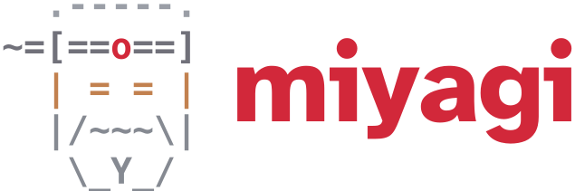
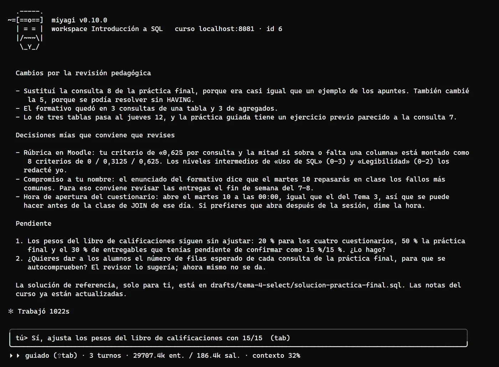

<h1>
  
</h1>

[](https://falkenslab.github.io/miyagi/) [](https://github.com/falkenslab/miyagi/releases/latest) [](https://github.com/falkenslab/miyagi/releases) [](https://github.com/falkenslab/miyagi/actions/workflows/verify.yml) [](https://github.com/falkenslab/moodle-sandbox) [](LICENSE) [](https://www.npmjs.com/package/@falkenslab/agent-kit) [](https://nodejs.org) [](https://github.com/falkenslab/miyagi/issues) [](https://github.com/falkenslab/miyagi/commits/main)

**Asistente de IA para docentes. Tú enseñas, y miyagi se ocupa del resto.**

Hoy trabaja en tu curso de Moodle, con tu cuenta de profesor y como lo harías tú: corrige con tu rúbrica, atiende el foro, monta temas, cuestionarios y juegos, escribe tu programación didáctica y te dice cómo va la clase. Toma apuntes del curso para acordarse de todo en la siguiente sesión, puedes enseñarle habilidades nuevas para tu asignatura y te consulta antes de publicar lo que verán tus alumnos.



## Documentación

Todo está en **[falkenslab.github.io/miyagi](https://falkenslab.github.io/miyagi/)**:

- **[Guía](https://falkenslab.github.io/miyagi/guia/)**: instalación, primeros pasos, el chat, qué pedirle, sus habilidades y preguntas frecuentes.
- **[Casos de uso](https://falkenslab.github.io/miyagi/casos-de-uso/)**: un aula de Introducción a SQL montada de cero, paso a paso y con capturas reales, de la programación a la corrección.
- **[Avanzado](https://falkenslab.github.io/miyagi/avanzado/)**: habilidades propias, la base de conocimiento, la configuración, las aprobaciones, las prácticas con Docker y la seguridad.

## Instalación

Necesitas Google Chrome, [Node.js](https://nodejs.org/) 20 o posterior (la versión LTS), una suscripción de Claude Pro o Max y un curso de Moodle en el que seas profesor. En una terminal (PowerShell en Windows, Terminal en Mac):

```
npm install -g https://github.com/falkenslab/miyagi/releases/latest/download/miyagi.tgz
```

Para actualizarlo, repite la misma línea; para desinstalarlo, `npm uninstall -g miyagi`. Los detalles, en [Instalar](https://falkenslab.github.io/miyagi/guia/instalar/).

## Primeros pasos

```
mkdir mi-curso
cd mi-curso
miyagi init      # la dirección del curso, tu cuenta, el tono y el idioma
miyagi ingest    # opcional: incorpora lo que dejes en sources/ (programación, rúbricas...)
miyagi chat      # y pídeselo con tus palabras
```

Por ejemplo: *«¿Qué entregas tengo sin corregir?»*, *«Corrige la Tarea 2 con la rúbrica que te dejé»*, *«¿Hay dudas sin responder en el foro?»* o *«Monta un tema sobre consultas SQL con su práctica y un cuestionario»*. Más ideas en [Qué pedirle](https://falkenslab.github.io/miyagi/guia/ideas/) y todas las órdenes en la [Referencia](https://falkenslab.github.io/miyagi/guia/referencia/).

## Para desarrolladores

miyagi está construido sobre [`@falkenslab/agent-kit`](https://github.com/falkenslab/agent-kit), igual que [student-agent](https://github.com/falkenslab/student-agent). Sus habilidades, comandos y prompts proceden del rol de profesor de moodle-agent. La especificación del proyecto (qué es, arquitectura, stack, convenciones y decisiones) está en [.minispec/](.minispec/README.md), y [CLAUDE.md](CLAUDE.md) explica cómo trabajar en el repo.

```
git clone https://github.com/falkenslab/miyagi.git
cd miyagi
npm install
npm start -- chat --dir <carpeta-del-curso>
npm run build                 # compila dist/ (necesario para npm link y las skills de prueba)
npm run typecheck && npm run lint
npm link                      # comando global miyagi desde este clon
npm pack                      # genera el .tgz que se publica en cada release
cd docs && npm ci && npm start   # el sitio de documentación, en local
```

### Skills de desarrollo

En `.claude/skills/`, para trabajar en este repositorio con Claude Code (no las usa el asistente):

| Skill | Para qué |
| --- | --- |
| `verify` | Comprobación completa: tipos, lint, compilación, los prompts de cada tipo de sesión, el catálogo y que la documentación lo recoja todo. |
| `update-docs` | Poner al día el sitio de documentación con cada cambio, antes de hacer commit o publicar una versión. |
| `commit` / `release` | Commits con las convenciones del repo y publicación de una versión con su paquete. |
| `sandbox-e2e` | Probar el asistente de principio a fin contra [moodle-sandbox](https://github.com/falkenslab/moodle-sandbox). |
| `simulate-course <descripción>` | Simular que el asistente construye un curso completo en el sandbox y dejar el informe. |
| `test-report` | Escribir el informe de una prueba en `tests/` con sus capturas. |
| `smoke-ingest` | Probar `ingest` con un temario y una rúbrica de ejemplo. |
| `student-impact-review` | Revisar cambios que afectan a lo que ven los estudiantes. |
| `upgrade-agent-kit` / `try-agent-kit-local` | Actualizar agent-kit o probar cambios suyos sin publicar. |

### Informes de pruebas

Cada prueba de principio a fin queda en [`tests/`](tests/README.md): una carpeta por prueba con el informe completo y sus capturas, y un índice.

## Licencia

[MIT](LICENSE).
