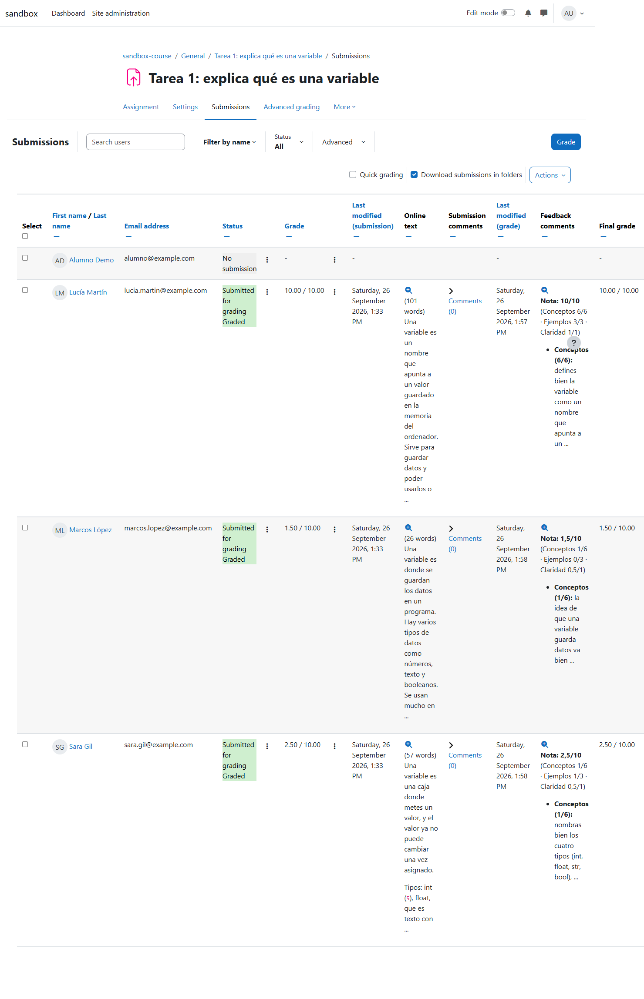
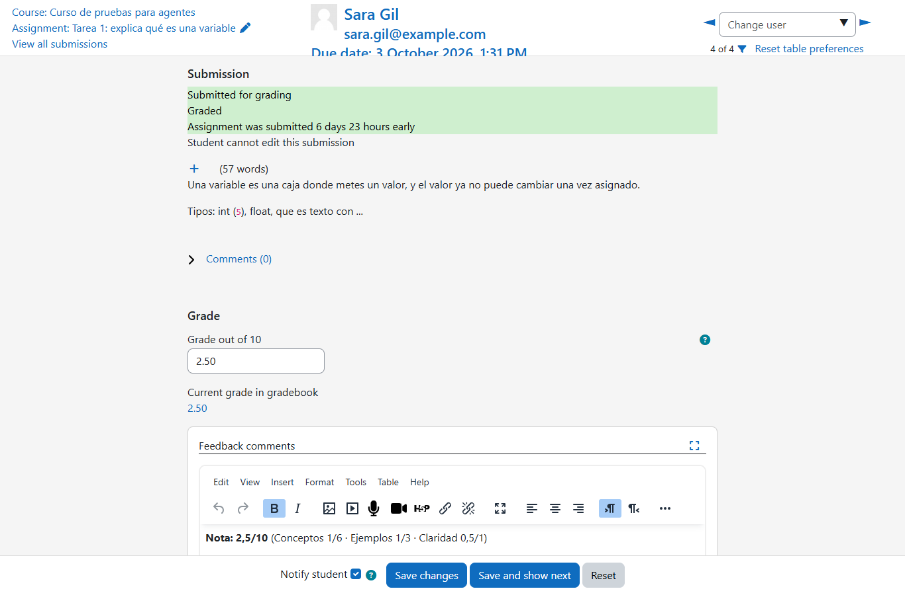
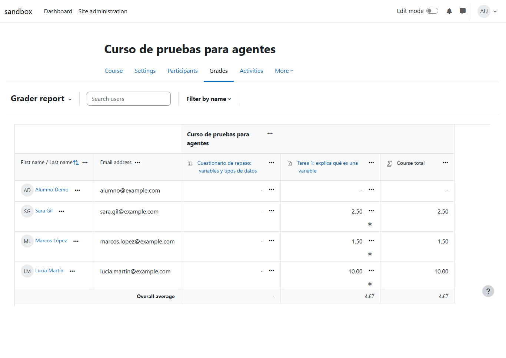
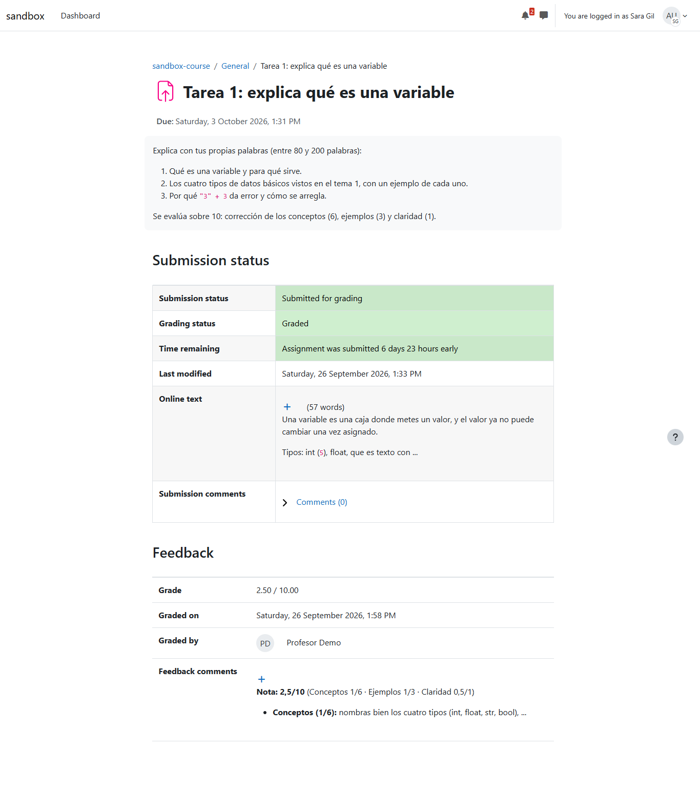
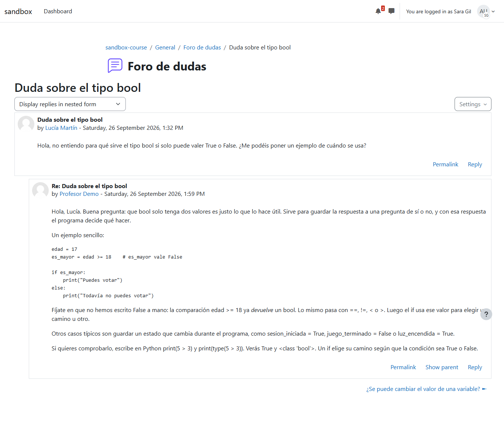
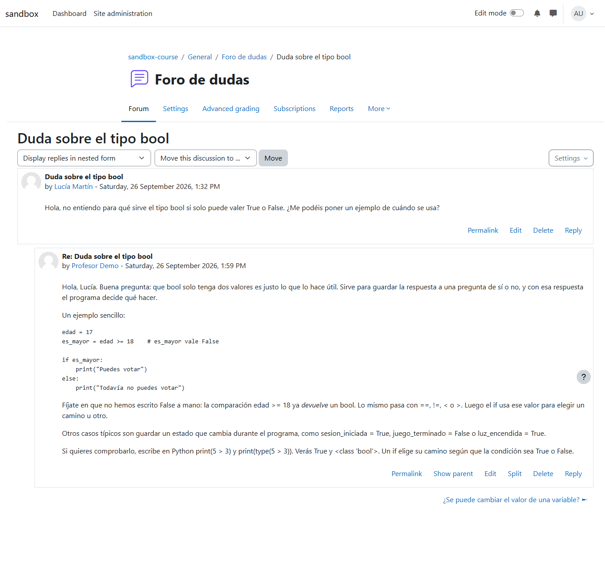
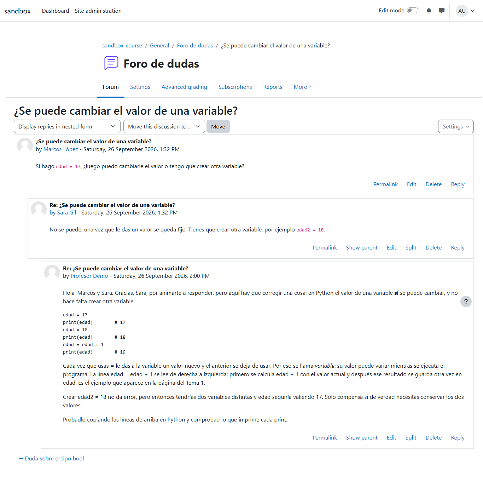
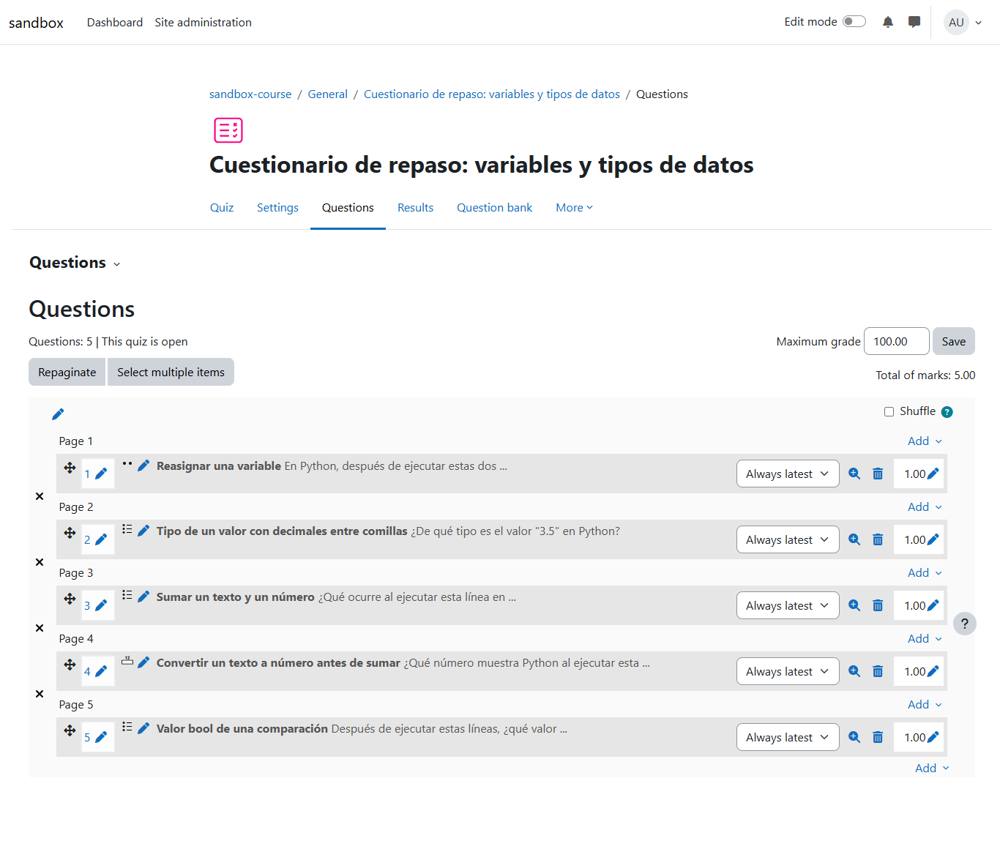
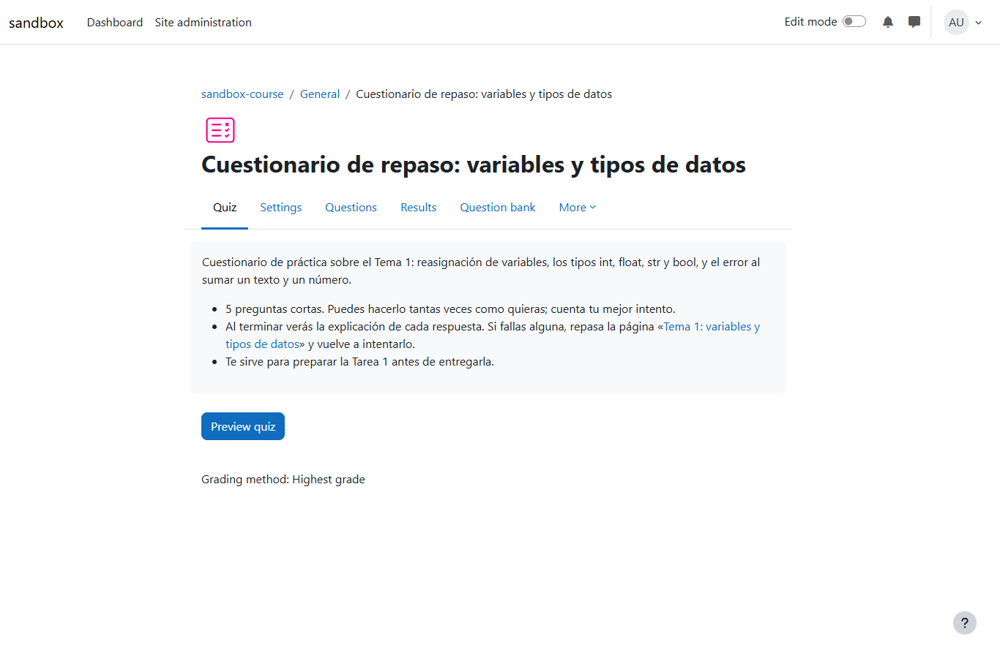

# Aula experimental del profesor

Primera prueba de principio a fin de teacher-agent en un Moodle real: explorar la instalación,
incorporar la rúbrica del profesor y gestionar el curso en modo `guided`, revisando y aprobando
cada publicación una a una.

| | |
| --- | --- |
| **Fecha** | 26 sep 2026, 13:34–14:07 (hora local) |
| **Entorno** | moodle-sandbox · Moodle 5.2 en Docker · `http://localhost:8081` |
| **Curso** | `sandbox-course` (id 2), con la siembra `npm run activity` |
| **Agente** | teacher-agent 0.1.0 (commit anterior a 0.2.0) · agent-kit 0.6.0 |
| **Cuenta** | `profesor` (editingteacher) |
| **Workspace** | `~/aulas/sandbox-profesor`, con `sources/rubrica-tarea-1.md` |
| **Informe publicado** | https://claude.ai/artifact/7FepvWPN3AsFvyvQEpeHiX (privado) |

## Veredicto

**Superada, con un hueco en las reglas ya corregido.** Las tres notas aplican bien la rúbrica
del profesor, las dos respuestas del foro son correctas y oportunas, y el cuestionario de
relleno quedó convertido en uno de repaso. Hubo 11 aprobaciones, una por publicación. La
excepción: el agente activó los comentarios de retroalimentación de la tarea sin pedir
aprobación, porque las reglas no mencionaban los cambios de configuración. Desde la versión
0.2.0 también los cubren.

## Qué se ejecutó

| Sesión | Duración | Acciones | Resultado |
| --- | --- | --- | --- |
| `teacher-agent explore --headless` | 3,7 min | 42 | 19 tipos de actividad y 17 de pregunta en `moodle-capabilities.md`, sin cambiar nada. Detectó el banco de preguntas bloqueado por tareas de Moodle sin ejecutar. |
| `teacher-agent ingest` | 1,1 min | 19 | La rúbrica de `sources/` convertida en la página de la Tarea 1 (pesos, niveles, políticas de entrega tardía y de entrega que falta) y la del tema, revisadas con `knowledge-lint`. |
| `teacher-agent run --mode guided --headless` | 14,4 min | 162 | Corrección de la tarea, foro, cuestionario y resumen del progreso. 11 aprobaciones respondidas por el canal de archivo de agent-kit tras revisar cada una. |

## Corrección de la Tarea 1

La actividad sembrada tiene una respuesta correcta para cada entrega. La rúbrica del profesor
pondera conceptos (6), ejemplos (3) y claridad (1). El plazo acaba el 3 de octubre.

| Estudiante | Entrega sembrada | Conceptos | Ejemplos | Claridad | Nota | Valoración |
| --- | --- | --- | --- | --- | --- | --- |
| Lucía Martín | Completa y correcta, 101 palabras | 6 / 6 | 3 / 3 | 1 / 1 | **10** | correcta |
| Marcos López | Correcta pero incompleta, 26 palabras | 1 / 6 | 0 / 3 | 0,5 / 1 | **1,5** | correcta |
| Sara Gil | Tres errores conceptuales, 57 palabras | 1 / 6 | 1 / 3 | 0,5 / 1 | **2,5** | en rango, discutible |
| Alumno Demo | Sin entrega | — | — | — | — | correcta: plazo abierto |

Los tres errores de Sara (una variable "no puede cambiar", el float como "texto con
decimales" y quitar las comillas para arreglar `"3" + 3`) son los que el temario del profesor
listaba como frecuentes, y el agente los señaló todos. En Ejemplos le dio 1 de 3. Con tres de
cuatro tipos bien, la rúbrica también admitía un 2. Por eso `grading-rubric` pide ahora fijar
por escrito cómo se aplica un nivel con rango la primera vez que aparece.

### Lo que ve el profesor

*Tabla de entregas: tres entregas "Submitted for grading · Graded" con su nota y
retroalimentación; Alumno Demo sin entrega ni nota.*

*Calificador, Sara Gil: la retroalimentación abre con el desglose por criterio. "Notify
student" está marcado por defecto, así que cada nota avisa a la alumna.*

*Libro de calificaciones: de aquí sacó el agente la media (4,67) y la mediana (2,5).*

### Lo que ve la alumna

Capturas con "Iniciar sesión como" Sara Gil, que es quien recibió la corrección más delicada.

*Tarea 1, vista de Sara: nota 2,50/10, "Graded by Profesor Demo" y el comentario por criterio.*

*Foro, vista de Sara: la corrección le agradece la respuesta y explica el error con un ejemplo
que puede ejecutar.*

## Foro de dudas

*Duda sobre bool, sin responder: respuesta con un ejemplo (`es_mayor = edad >= 18`), que las
comparaciones devuelven bool y cómo comprobarlo. El `if` todavía no está en el temario del
tema 1.*

*Respuesta errónea de una compañera: Sara decía que el valor "se queda fijo". El profesor lo
corrige con tacto, se dirige a Marcos y a Sara y explica la reasignación paso a paso.*

La segunda respuesta falló en el primer intento: el editor de texto aún no había cargado y el
mensaje salió vacío. El agente comprobó el hilo, vio que no estaba publicado y reintentó una
vez. En la base de datos hay exactamente una respuesta suya por hilo, sin duplicados.

## Del "Quiz de prueba" a un cuestionario de repaso

*Cinco preguntas, cada una sobre un error visto en las entregas o en el foro. La primera
reescribe la pregunta de relleno ("The answer is true.").*

*Nombre y descripción nuevos. Lo que dice la descripción se comprobó en la base de datos:
intentos ilimitados (`attempts = 0`) y se queda la mejor nota (`grademethod = 1`).*

Editar era seguro porque nadie había intentado el cuestionario; `quiz-design` convierte esa
condición en regla.

## Las 11 aprobaciones, en orden

Hora local de cada petición de `request_human_approval`, con lo que pedía. Todas se aprobaron
tras revisarlas.

| # | Hora | Publicación |
| --- | --- | --- |
| — | 13:56 | **Sin aprobación**: activar "Feedback comments" en la tarea (corregido en 0.2.0) |
| 1 | 13:57 | Nota de Lucía: 10/10, desglose 6 · 3 · 1 y una sugerencia (`str(3)`) |
| 2 | 13:57 | Nota de Marcos: 1,5/10 |
| 3 | 13:58 | Nota de Sara: 2,5/10 |
| 4 | 13:59 | Respuesta a la duda sobre bool |
| 5 | 13:59 | Corrección de la respuesta de Sara en el foro |
| 6 | 14:02 | Reescribir la pregunta 1 del cuestionario (0 intentos) |
| 7 | 14:03 | Añadir: ¿de qué tipo es `"3.5"`? |
| 8 | 14:03 | Añadir: ¿qué ocurre con `print("3" + 3)`? (distractores 6, 33 y 3) |
| 9 | 14:04 | Añadir: resultado de `int("3") + 3` (numérica) |
| 10 | 14:05 | Añadir: valor de `edad >= 18` (distractor `"False"` entre comillas) |
| 11 | 14:05 | Renombrar y describir el cuestionario |

## Hallazgos

| Hallazgo | Estado | Dónde |
| --- | --- | --- |
| Activó "Feedback comments" sin aprobación: las reglas solo listaban notas, mensajes y contenido nuevo | Corregido en 0.2.0 | `prompts/system/teacher-run.md`, `teacher-chat.md`, `prompts/tools/human-approval-description.md` |
| Anotó que las peticiones "llegaron en inglés": el mensaje inicial de `ingest` lo escribe el programa | Corregido en 0.2.0 | `prompts/system/language.md` |
| Banco de preguntas bloqueado: el sandbox no ejecutaba las tareas ad hoc de Moodle 5 | Corregido | moodle-sandbox: `seed`/`activity` las ejecutan, `npm run tasks` |
| Las entregas sembradas quedaban en borrador y el profesor no tenía nada que corregir | Corregido | moodle-sandbox: `seed/seed-teacher-activity.php` |
| Nivel de rúbrica con rango aplicado sin regla escrita (el 1 o 2 de Sara) | Convertido en regla | `plugin/skills/grading-rubric` |

## Aprendizaje incorporado a las skills

| Skill | Qué se ha añadido |
| --- | --- |
| `grading-rubric` | Comprobar que la tarea admite comentarios de retroalimentación antes de calificar (activarlos requiere aprobación); dónde están la tabla de entregas y el calificador; fijar cómo se aplica un nivel con rango |
| `forum-post` | Esperar a que cargue el editor; comprobar el hilo tras publicar; reintentar una sola vez y solo si no se publicó |
| `moodle-navigation` | Cerrar los recorridos de bienvenida; "Edit mode" y "Add content" → "Activity or resource"; bancos de preguntas por actividad en Moodle 5 y el bloqueo por tareas pendientes |
| `quiz-design` | Editar preguntas solo con 0 intentos; cada guardado con su aprobación; comprobar "Total of marks" |
| `quiz-bulk-import` | En Moodle 5 se importa en el banco del cuestionario (`question/bank/importquestions/import.php?cmid=…`) |

Todos los textos de Moodle citados en las skills se comprobaron en los paquetes de idioma de
Moodle 5.2 del sandbox.

## Base de conocimiento del aula

- 12 páginas y 57 enlaces, ninguno roto; todas en `index.md`.
- La rúbrica de `sources/` tiene su página de resumen, enlazada desde la de la Tarea 1.
- `progress.md` resume la clase sin nombres ("una persona no ha entregado todavía"), comprobado
  con `check-knowledge.mjs --names` para los seis nombres y apellidos sembrados.

## No cubierto

- La siembra y las tareas de Moodle en una instalación del sandbox desde cero.
- El modo `chat`, que necesita un terminal real.
- Corregir con una rúbrica nativa de Moodle ("Advanced grading") y la importación GIFT en bloque.

---

*Capturas tomadas al terminar la prueba, como admin y con "Iniciar sesión como" para la vista de
la alumna, ocultando el índice lateral y el pie fijos de Moodle. Los nombres de estudiantes son
datos ficticios sembrados por moodle-sandbox; ninguna contraseña aparece en el informe.*
