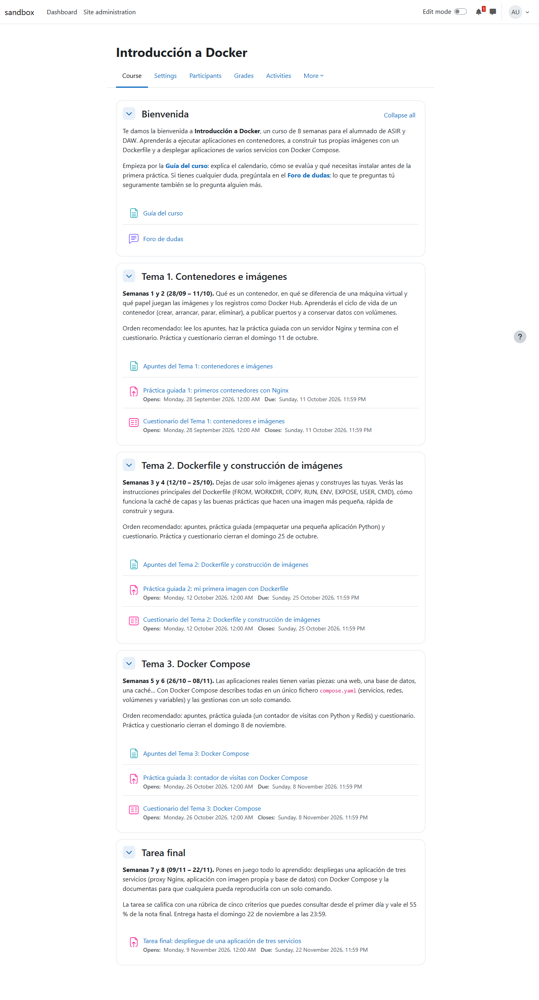
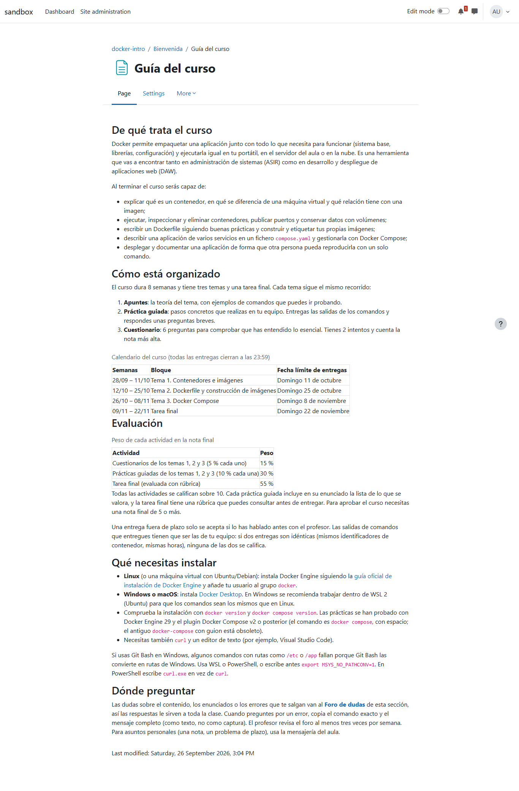
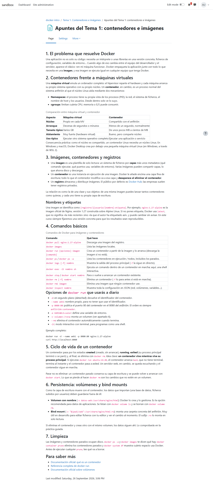
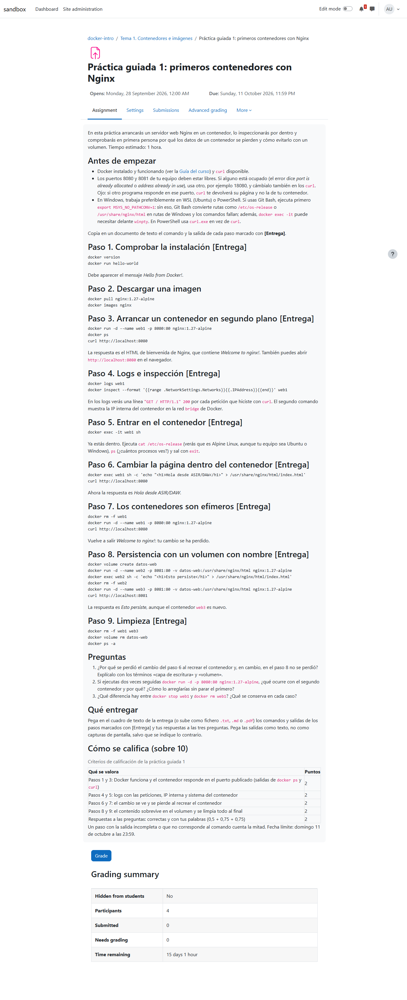
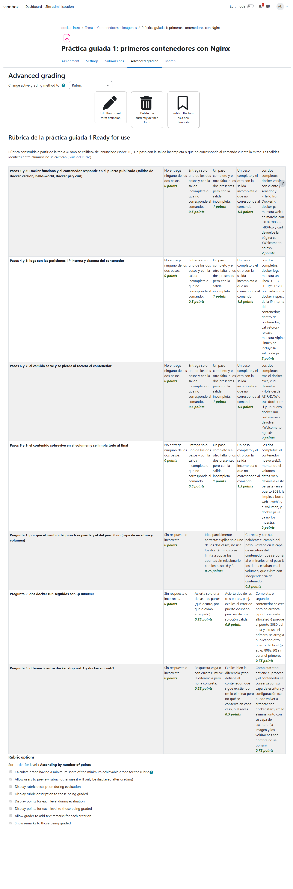
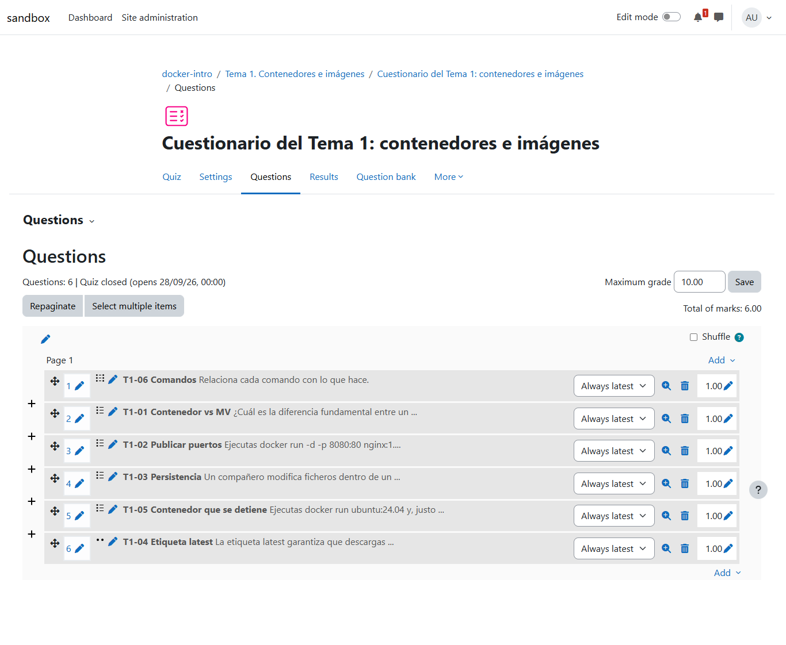
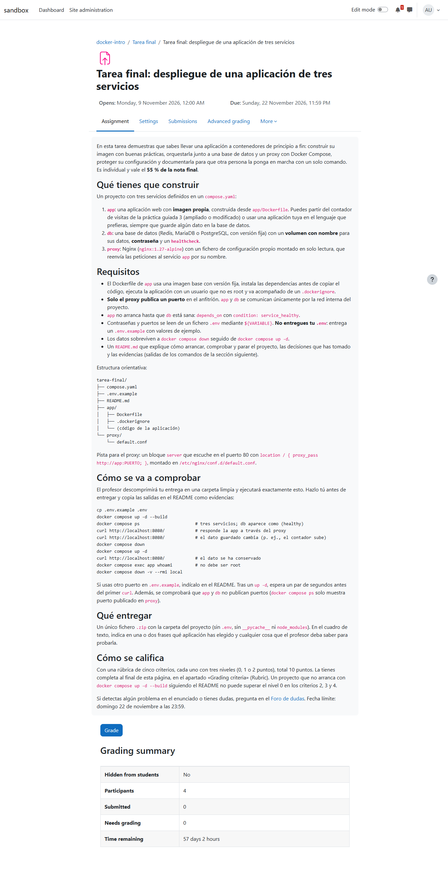
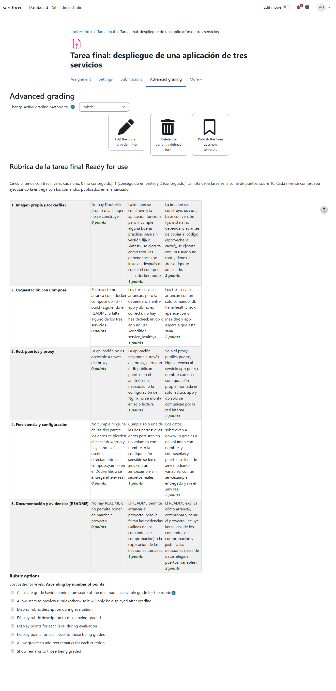
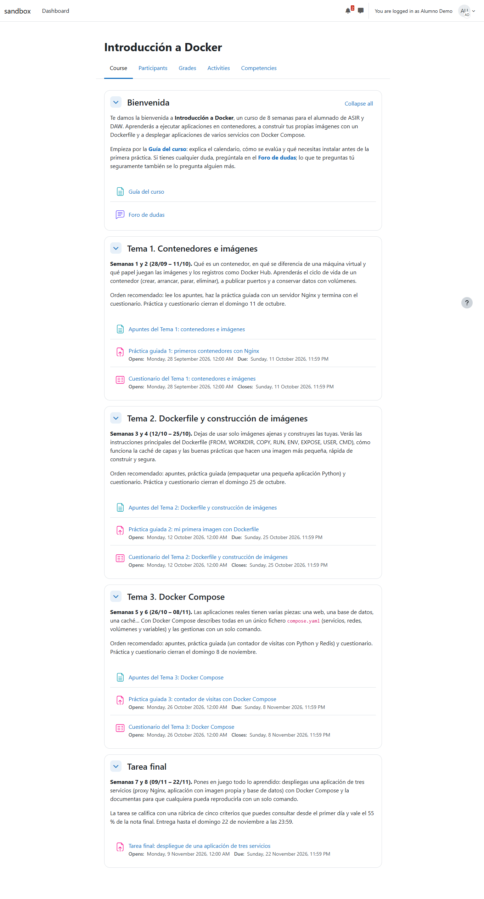

# Curso "Introducción a Docker" construido por el agente

Primera simulación de un curso completo: a partir de una descripción de tres líneas,
teacher-agent planificó y creó en Moodle un curso de 8 semanas (bienvenida, tres temas con
apuntes, práctica guiada y cuestionario, y una tarea final con rúbrica), comprobó en Docker las
cuatro prácticas antes de publicarlas y lo revisó como alumno. En una segunda sesión añadió las
rúbricas que faltaban en las prácticas.

| | |
| --- | --- |
| **Fecha** | 26 sep 2026, 14:52–15:41 (hora local) |
| **Entorno** | moodle-sandbox · Moodle 5.2 en Docker · `http://localhost:8081` · Docker Desktop 29.6 en el anfitrión |
| **Curso** | `docker-intro` (id 3), creado vacío con `npm run course` |
| **Agente** | teacher-agent en el commit `f8aaf88` (posterior a 0.2.0) · agent-kit 0.6.0 |
| **Cuenta** | `profesor` (editingteacher) |
| **Workspace** | temporal, con `allowPracticeRunner: true` y sin material en `sources/` |
| **Modo** | `run --mode guided --headless --task "…"`, con las aprobaciones respondidas por `auto-approve.mjs` (solo sandbox) y revisadas después |

**Encargo:** *"Introducción a Docker para FP de grado superior (ASIR/DAW), en español. Tres
temas: 1) contenedores e imágenes, 2) Dockerfile y construcción de imágenes, 3) Docker
Compose. Cada tema con apuntes propios, una práctica guiada y un cuestionario corto. Una sección
de bienvenida con la guía del curso y un foro de dudas, y una tarea práctica final evaluable con
rúbrica."*

## Veredicto

**Superada con hallazgos.** El curso está completo y es de calidad: todo lo planificado existe,
en orden, con contenido real, fechas coherentes y pesos configurados. Las prácticas se
comprobaron ejecutándolas antes de publicarlas, y eso detectó y corrigió un comando que ya no
funciona en Docker 29. Pero hubo cuatro fallos que se han corregido en las skills y en los
prompts:

- las prácticas se crearon sin rúbrica;
- las 18 preguntas de los cuestionarios se publicaron sin que ninguna aprobación las mostrara;
- las preguntas quedaron desordenadas;
- el subagente de prácticas usó nombres y puertos que podían chocar con contenedores del
  profesor.

## Qué se ejecutó

| Sesión | Duración | Acciones | Resultado |
| --- | --- | --- | --- |
| `explore --headless` | 2,3 min | 27 | Tipos de actividad y de pregunta del Moodle en `moodle-capabilities.md` |
| `run --task "<encargo>"` (construcción) | 30,2 min | 297 (42 de `Bash` en el subagente) | Curso completo; 18 aprobaciones; 4 prácticas ejecutadas en Docker por `practice-runner` |
| `run --task "añade rúbricas a las prácticas"` | 7,1 min | 71 | Tres rúbricas nativas, una aprobación por rúbrica |

## El curso construido

Comprobado en la base de datos de Moodle, no en lo que dijo el agente:

| Sección | Recursos y actividades | Calendario | Peso |
| --- | --- | --- | --- |
| Bienvenida | Página "Guía del curso", "Foro de dudas" | — | — |
| Tema 1. Contenedores e imágenes | Apuntes, Práctica guiada 1 (Nginx, puertos, volúmenes), cuestionario de 6 preguntas | 28/09 – 11/10 | 10 % + 5 % |
| Tema 2. Dockerfile y construcción de imágenes | Apuntes, Práctica guiada 2 (imagen propia de una app Python), cuestionario de 6 | 12/10 – 25/10 | 10 % + 5 % |
| Tema 3. Docker Compose | Apuntes, Práctica guiada 3 (contador de visitas con Redis), cuestionario de 6 | 26/10 – 08/11 | 10 % + 5 % |
| Tarea final | Despliegue de tres servicios (proxy Nginx, app propia, Redis con contraseña, healthcheck, `.env`) con rúbrica de 5 criterios | 09/11 – 22/11 | 55 % |

- 5 secciones con resumen, 12 módulos visibles, 4 tareas sobre 10 con fechas en orden, 3
  cuestionarios (6 preguntas, 2 intentos con la nota más alta, 20 minutos).
- Rúbricas nativas "Ready for use" en las 4 tareas: la final desde la primera sesión, y las tres
  prácticas desde la segunda, con 7-8 criterios de niveles descritos y un total de 10 cada una.
- Plan en `knowledge/course-plan.md` y 18 páginas en la base de conocimiento: 73 enlaces sin
  romper, ningún nombre de alumno.

*La portada: cada sección dice sus semanas, qué se aprende y el orden recomendado.*

*La guía: objetivos, calendario, evaluación, qué instalar y dónde preguntar.*

*Apuntes propios del tema 1, con ejemplos y versiones fijadas (`nginx:1.27-alpine`).*

## Las prácticas, comprobadas en Docker

Con `allowPracticeRunner`, el agente escribió cada enunciado y su solución en `practice/<slug>/`
y delegó en el subagente `practice-runner` seguirlo paso a paso. Las cuatro comprobaciones
corrieron en paralelo (varias llamadas al subagente en un mismo turno) y encontraron problemas
reales antes de publicar:

| Práctica | Corrección aplicada antes de publicar |
| --- | --- |
| 1 | `docker inspect --format '{{.NetworkSettings.IPAddress}}'` ya no devuelve nada en Docker 29 → `{{range .NetworkSettings.Networks}}{{.IPAddress}}{{end}}`; avisos para Git Bash (`MSYS_NO_PATHCONV=1`) y puertos ocupados |
| 2 | `RUN useradd` antes de `COPY` para aprovechar la caché; un comentario erróneo y una nota de borrador eliminados |
| 3 | El primer `curl` tras `up -d` puede fallar 1-2 s → aviso de "espera y repite"; texto "1 veces" corregido en la app |
| Tarea final | La solución modelo supera todas las comprobaciones |

*Práctica 1: nueve pasos con los comandos exactos, qué entregar y la tabla de criterios.*

*La rúbrica que se añadió en la segunda sesión: cada nivel describe lo que se ve en la entrega,
con las salidas concretas que promete el enunciado.*

### Lo que hizo el subagente en el anfitrión

Se auditaron en directo sus 42 comandos. Etiquetó sus imágenes y contenedores
(`teacher-agent=practice`), limitó memoria y CPU, publicó puertos solo en `127.0.0.1` en sus
propias pruebas, limpió con `docker compose down -v --rmi local`, **detectó que el 8081 del
enunciado estaba ocupado por el propio Moodle y pasó al 18081**, y respetó la imagen
`python:3.12-slim` que el profesor ya tenía. Pero al seguir los enunciados al pie de la letra:

- usó los nombres genéricos del enunciado (`web1`, el volumen `datos-web`) y ejecutó
  `docker rm -f web1`, que habría borrado un contenedor del profesor con ese nombre;
- lanzó la práctica 3 como proyecto de Compose `run` (el nombre de la carpeta), cuyo
  `down -v` borraría los volúmenes de cualquier otro proyecto `run`;
- no aplicó los límites de recursos en esos comandos, y dejó descargadas `nginx:1.27-alpine` y
  `redis:7-alpine`.

No hubo daños (no existían contenedores con esos nombres), pero son huecos reales: se han
cerrado en su prompt.

## Cuestionarios y tarea final

*Cuestionario 1: seis preguntas bien planteadas, pero en orden 06, 01, 02, 03, 05, 04 (en los
tres cuestionarios igual): añadir varias desde el banco no respeta el orden del GIFT, y
"Shuffle" está desactivado.*

*Tarea final y su rúbrica de 5 criterios × 3 niveles, creada con "Advanced grading" en la
primera sesión.*

*El curso visto por Alumno Demo: todo visible, fechas en orden.*

## Aprobaciones

Nadie las revisó en directo: `auto-approve.mjs` las aprobó y las registró, y se revisan aquí.

| # | Hora | Publicación | Revisión |
| --- | --- | --- | --- |
| 1 | 15:03 | Sección 0 "Bienvenida" con su resumen | Bien |
| 2 | 15:04 | Página "Guía del curso" | Bien |
| 3 | 15:04 | Foro "Foro de dudas" | Bien |
| 4 | 15:05 | Sección "Tema 1" con resumen y fechas | Bien |
| 5 | 15:06 | Apuntes del tema 1 | Bien |
| 6 | 15:07 | Práctica guiada 1 (enunciado comprobado en Docker) | Bien, pero **sin rúbrica** |
| 7 | 15:09 | Cuestionario 1 "de momento sin preguntas; en el paso siguiente importo 6" | **La importación siguiente no pidió aprobación** |
| — | 15:09 | Importar y añadir las 6 preguntas del cuestionario 1 | **Publicado sin aprobación** |
| 8 | 15:11 | Tres secciones de golpe (temas 2 y 3, tarea final) | **Agrupada**: una por sección |
| 9 | 15:12 | Apuntes del tema 2 | Bien |
| 10 | 15:13 | Práctica guiada 2 | Bien, pero **sin rúbrica** |
| 11 | 15:14 | Cuestionario 2 "y después importar sus 6 preguntas" (solo los temas) | **Agrupada**: las preguntas no se ven |
| 12 | 15:16 | Apuntes del tema 3 | Bien |
| 13 | 15:16 | Práctica guiada 3 | Bien, pero **sin rúbrica** |
| 14 | 15:17 | Cuestionario 3 "e importar sus 6 preguntas" (solo los temas) | **Agrupada** |
| 15 | 15:19 | Tarea final | Bien |
| 16 | 15:20 | Rúbrica de la tarea final (5 × 3) | Bien |
| 17 | 15:20 | Pesos del libro de calificaciones | Bien, pero el total queda "sobre 70" |
| 18 | 15:22 | Corregir en la tarea final dónde está la rúbrica (lo vio al revisar como alumno) | Bien |
| R1-R3 | 15:36-15:39 | Una rúbrica por práctica (segunda sesión) | Bien: una aprobación por rúbrica |

## Hallazgos

| Hallazgo | Estado | Dónde |
| --- | --- | --- |
| Las prácticas se crearon sin rúbrica: el agente leyó "tarea final con rúbrica" como "solo la tarea final" | Corregido y aplicado al curso (segunda sesión) | `plugin/skills/course-building`, `plugin/skills/rubric-design` |
| Las 18 preguntas se importaron sin una aprobación que las mostrara; tres secciones en una sola aprobación | Corregido | `plugin/skills/quiz-bulk-import` (la importación es su propia publicación, con cada pregunta), `plugin/skills/course-building` (un elemento por aprobación) |
| Preguntas desordenadas en los tres cuestionarios | Corregido en la skill; el curso sigue desordenado | `plugin/skills/quiz-bulk-import` (nombres con posición y comprobar el orden) |
| El total del curso se muestra sobre 70 aunque la guía habla de nota sobre 10 | Convertido en regla | `plugin/skills/course-building` (comprobar el libro de calificaciones) |
| Moodle no reconoce `.md` como tipo de archivo aceptado | Convertido en regla | `plugin/skills/course-building` |
| `practice-runner`: nombres genéricos, `rm -f` por nombre, proyecto Compose `run`, sin límites al seguir el enunciado, imágenes descargadas sin borrar | Corregido | `prompts/system/practice-runner.md` |
| Las cuatro comprobaciones corrieron en paralelo en la máquina del profesor | Aceptado; los nombres y puertos únicos lo hacen seguro | `prompts/system/practice-runner.md` |

## Qué se añadió a las skills

| Skill o prompt | Qué se ha añadido |
| --- | --- |
| `course-building` | Rúbrica nativa para toda actividad corregida a mano; un elemento por aprobación; comprobar libro de calificaciones y tipos de archivo |
| `rubric-design` | El camino exacto en Moodle 5 ("Advanced grading" → Rubric → "Save rubric and make it ready"); la rúbrica en el calificador es la norma |
| `quiz-bulk-import` | La importación, con su propia aprobación y cada pregunta en el resumen; nombres con posición; comprobar el orden |
| `practice-runner.md` | Nombres con prefijo `tap-<práctica>-`, `docker compose -p`, puertos altos libres en `127.0.0.1`, límites siempre, borrar solo lo creado |

## No cubierto

- Que una entrega real de un alumno se ejecute y se corrija con `practice-testing` (el curso aún
  no tiene entregas).
- Revisar las aprobaciones en directo (aquí se aprobaron todas automáticamente).
- Reordenar las preguntas de los tres cuestionarios del curso.

---

*Capturas tomadas al terminar las dos sesiones, como admin y como Alumno Demo ("Log in as"),
ocultando el índice lateral y el pie fijos de Moodle. Todo el contenido del curso es del agente:
el workspace no tenía material del profesor.*
