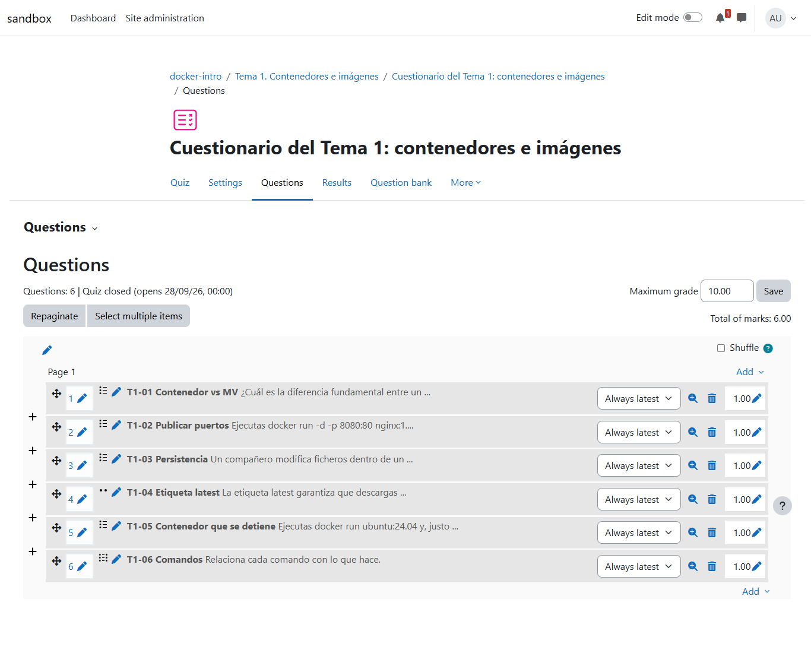
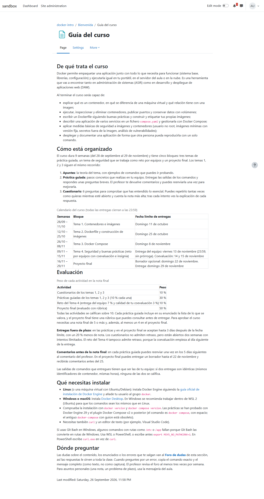
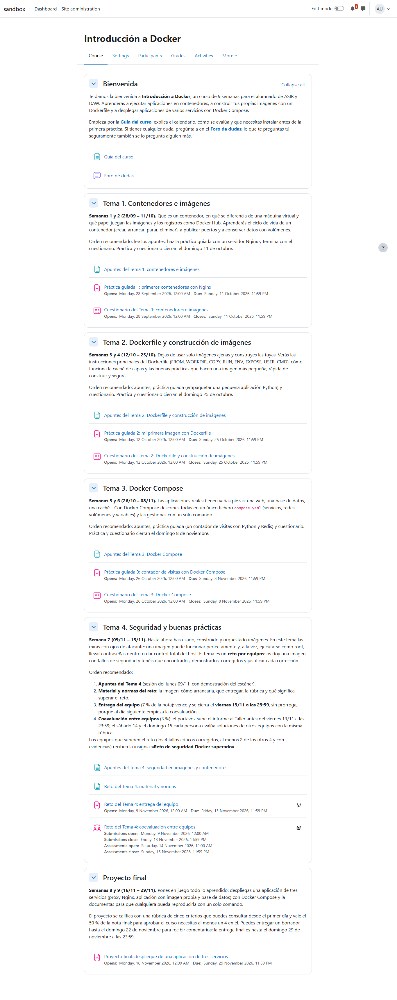
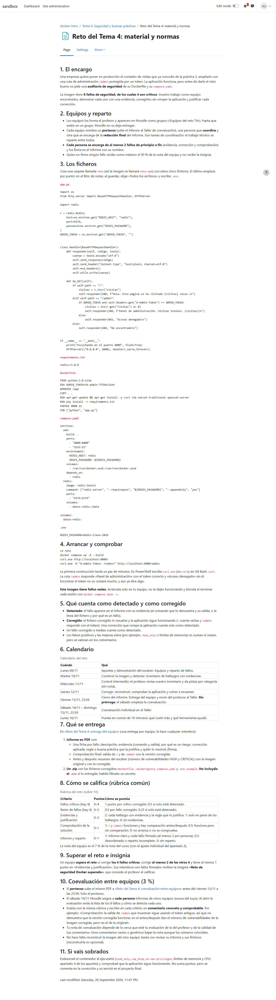
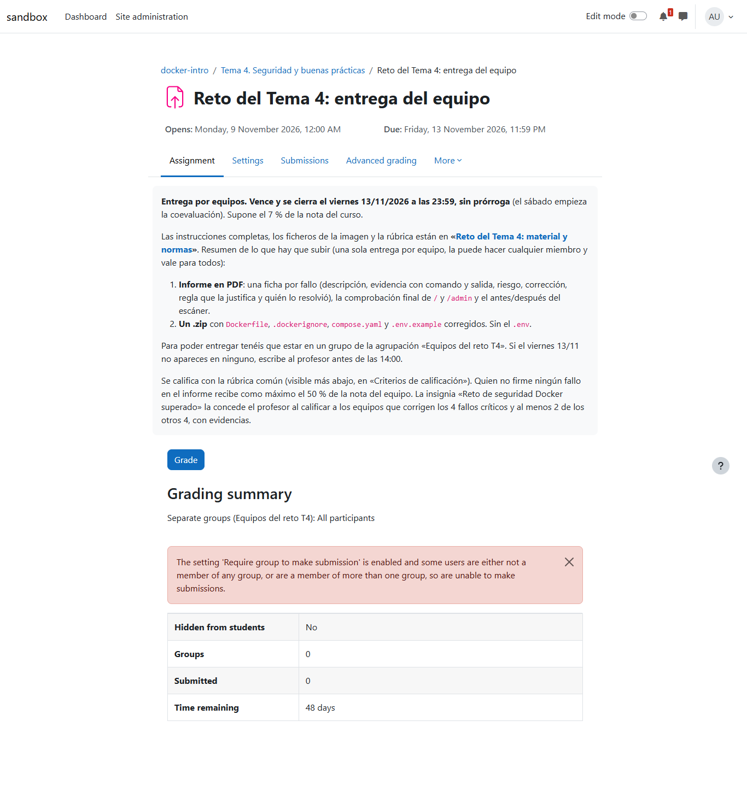
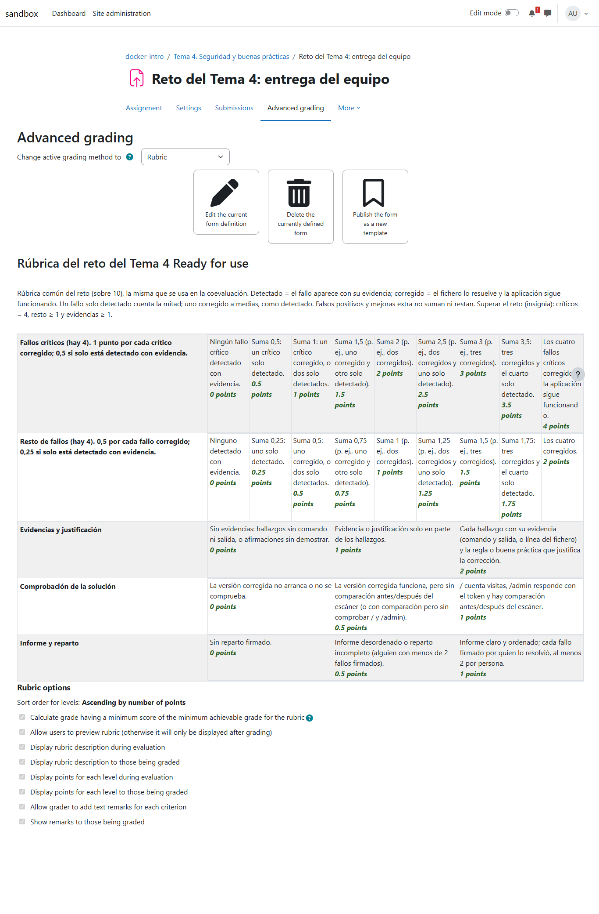
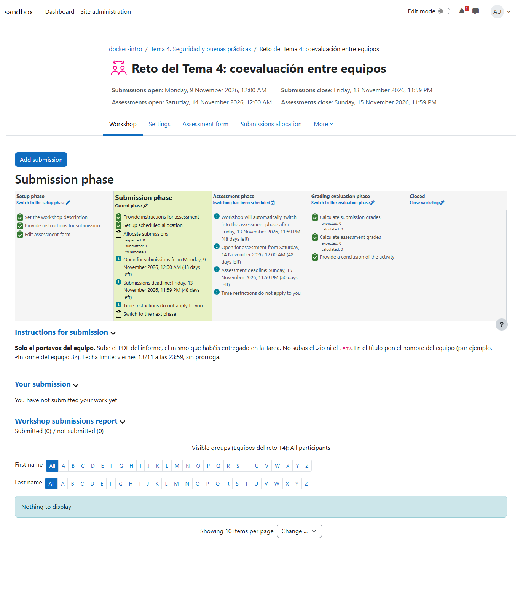
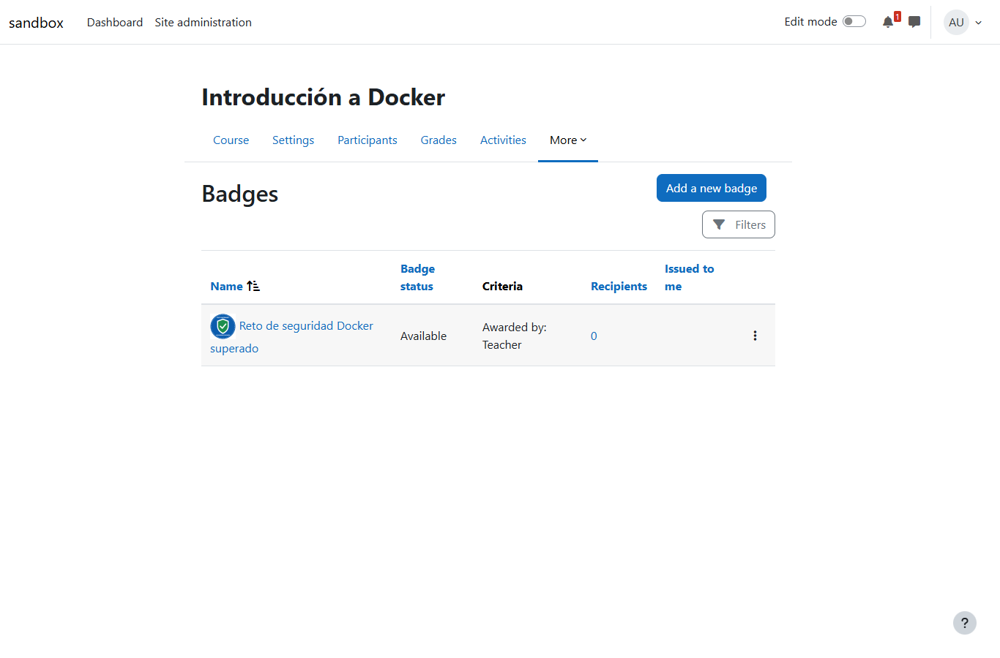

# Programación didáctica, alineación y un tema por retos

Prueba de las capacidades pedagógicas nuevas sobre el curso "Introducción a Docker" ya construido. A partir de un borrador del profesor, teacher-agent escribió la programación didáctica, comparó el aula con ella, corrigió lo que no cuadraba y construyó el tema que faltaba: un reto por equipos con coevaluación entre equipos e insignia. Por primera vez se usaron los tres subagentes: `researcher`, `pedagogy-reviewer` y `practice-runner`.

- **Fecha:** 26 sep 2026, 23:01–00:01 (hora local)
- **Entorno:** moodle-sandbox · Moodle 5.2 en Docker · `http://localhost:8081` · Docker Desktop 29.6
- **Curso:** `docker-intro` (id 3), el del informe anterior
- **Agente:** teacher-agent en el commit `6ede8a1` (0.2.0 + metodologías, subagentes y skills de programación) · agent-kit 0.6.0
- **Workspace:** el de la simulación anterior, con `allowPracticeRunner: true` y `sources/programacion-borrador.md`
- **Modo:** `run --mode guided --headless --task "…"`, aprobaciones con `auto-approve.mjs` (solo sandbox) revisadas después

**El borrador del profesor** (`sources/programacion-borrador.md`) pide cosas que el aula no tenía, a propósito: 9 semanas en vez de 8, un tema 4 de seguridad como reto por equipos con coevaluación e insignia, otros pesos (cuestionarios 10 %, prácticas 30 %, reto 10 %, proyecto 50 %), entregas tarde con −20 % y cuestionarios repetibles.

## Veredicto

**Superada con hallazgos menores.** La programación es completa y coherente, `course-alignment` detectó todas las diferencias sembradas y las corrigió, y el tema 4 aplica la metodología pedida con piezas de Moodle bien configuradas (tarea por grupos, taller de coevaluación entre equipos, insignia, rúbricas). Los tres subagentes funcionaron, y `practice-runner` ya respetó las reglas de nombres y limpieza corregidas en el informe anterior. Quedan tres ajustes de reglas (aprobaciones que agrupan textos distintos, una explicación incorrecta sobre penalizaciones, intentos de usar la terminal) y dos lecciones de Moodle (taller entre equipos, rúbrica con enteros), ya incorporados.

## Qué se ejecutó

| Sesión | Duración | Acciones | Subagentes | Aprobaciones |
| --- | --- | --- | --- | --- |
| Programación + alineación | 18,9 min | 210 | `pedagogy-reviewer` | 7 |
| Tema 4 con `unit-building` | 39,1 min | 297 (24 de `Bash` en `practice-runner`) | `researcher`, `pedagogy-reviewer`, `practice-runner` | 16 |

## La programación didáctica

`knowledge/teaching-plan.md` (≈2.100 palabras, genérica, sin normativa), enlazada con cada tema: contexto, 5 objetivos, 12 criterios de evaluación (`CE1.a` … `CE5.b`) con las actividades que los evalúan, unidades y calendario, metodología, evaluación y calificación, atención a la diversidad y una lista de lo pendiente de confirmar. Lo que el borrador no decía está marcado **PROPUESTA** (18 marcas): los criterios y la atención a la diversidad, entre otros.

`pedagogy-reviewer` la calificó "lista con cambios" y el agente aplicó su crítica:
- tarea de grupo más taller solo para la coevaluación (el taller no admite entrega en grupo);
- fases del reto con minilección y demostración del escáner;
- peso real de la parte individual;
- reenvío de prácticas acotado a 5 días sin pisar la siguiente;
- el orden entre penalización por retraso y requisito del 4;
- evidencias para tres criterios que no las tenían.

## La alineación

`course-alignment` escribió la comparación en `knowledge/syntheses/course-alignment.md` y corrigió:

| Diferencia con la programación | Corrección |
| --- | --- |
| Preguntas desordenadas en los tres cuestionarios | Reordenadas 01 → 06 (comprobado en la base de datos) |
| Cuestionarios con 2 intentos; el borrador pide que se puedan repetir | Intentos ilimitados, nota más alta |
| Entregas tarde aceptadas hasta 3 días | Fecha de corte a 3 días en las tres prácticas |
| "Tarea final" en el aula, "Proyecto final" en la programación | Renombrada |
| Pesos distintos | Aplicados; sin el reto, Moodle los reescaló, y se rehicieron al crear el tema 4 |
| Guía del curso con 8 semanas, 2 intentos y pesos antiguos | Actualizada |
| Tema 4 inexistente | Anotado como pendiente (se construyó en la sesión siguiente) |

Quedaron para el profesor, bien señalados: el total del curso "sobre 70" (la programación lo quiere sobre 10), el −20 % por retraso y el requisito del 4 en el proyecto.

*El cuestionario 1, ahora en orden T1-01 → T1-06.*

*La guía, con 9 semanas, el tema 4 y la política de entregas.*

## El tema 4: reto por equipos

- **Investigación** (`researcher`): buenas prácticas de seguridad de Docker vigentes, con documentación de Docker, OWASP y Trivy como fuentes principales, guardadas en `knowledge/syntheses/seguridad-docker-2026.md`. Dos hallazgos cambiaron el diseño.
- **Diseño** (`teaching-methodologies`, revisado por `pedagogy-reviewer` antes de construir): la imagen del reto es el contador de visitas de la práctica 3, que ya conocen, con 8 fallos plantados (4 críticos). Cada miembro responde de 2 fallos completos, y los roles solo coordinan. La puesta en común pasa al 16/11, para que nadie oiga los fallos de otros equipos antes de entregar.
- **Comprobación en Docker** (`practice-runner`): la imagen con fallos y la solución funcionan; Trivy baja las vulnerabilidades altas y críticas de 227 a 46, y hadolint revisó ambos Dockerfile. Quedó sin probar el montaje del socket de Docker dentro del contenedor.

| Pieza | Configuración comprobada en la base de datos |
| --- | --- |
| Sección "Tema 4. Seguridad y buenas prácticas" | Entre el tema 3 y el proyecto final |
| Apuntes y página del reto (material y normas) | Publicados |
| Agrupación "Equipos del reto T4" | Creada vacía: los grupos los crea el profesor |
| Tarea "Reto del Tema 4: entrega del equipo" | Entrega por grupos, rúbrica nativa, 7 % |
| Taller "coevaluación entre equipos" | Rúbrica, envío del 9 al 13/11, evaluación del 14 al 15/11, asignación programada de 2 revisiones por persona excluyendo al propio equipo, 3 % |
| Insignia "Reto de seguridad Docker superado" | Activa, con imagen, concedida por el profesor |
| Libro de calificaciones | Pesos de la programación, suma exacta 100 % |

*El encargo del reto, sus fases y las normas del trabajo en equipo.*

*El taller: fechas de cada fase, cambio automático a la fase de evaluación, y "Visible groups" para que los equipos se evalúen entre sí.*

## Lo que hizo `practice-runner`, auditado

Con las reglas corregidas tras el informe anterior:
- proyectos de Compose `tap-reto-tema-4-seguridad-start` y `-solution` y una caché con prefijo `tap-`;
- un `compose.tap.yaml` propio para puertos y límites, sin tocar los archivos de los alumnos;
- Trivy fijado a `0.74.0`, límites de memoria y CPU, carpeta en solo lectura;
- limpieza al final de todo lo suyo, incluida `python:3.13-slim`, que se comprobó que no estaba en el listado inicial.

Se saltó los límites en un solo comando corto (`docker run --rm --network none python:3.8-slim cat /etc/debian_version`).

## Aprobaciones

| # | Hora | Publicación | Revisión |
| --- | --- | --- | --- |
| A1 | 23:09 | Reordenar el cuestionario 1 | Bien |
| A2 | 23:09 | Reordenar los cuestionarios 2 y 3 | Mismo cambio en dos elementos, nombrados: aceptable |
| A3 | 23:10 | Intentos ilimitados en los tres cuestionarios | Mismo ajuste, nombrados: aceptable |
| A4 | 23:12 | Fecha de corte a 3 días en las tres prácticas | Mismo ajuste, nombrados: aceptable |
| A5 | 23:14 | Renombrar "Tarea final" → "Proyecto final" | Bien |
| A6 | 23:15 | Pesos del libro de calificaciones | Bien |
| A7 | 23:17 | Textos de la guía y de dos resúmenes de sección en una sola aprobación | **Agrupa textos distintos** |
| B1-B3 | 23:43-23:47 | Sección del tema 4, apuntes, página del reto | Bien |
| B4-B6 | 23:47-23:49 | Agrupación, tarea del reto, su rúbrica | Bien |
| B7-B11 | 23:51-23:54 | Taller, su formulario, modo de grupo, asignación programada, paso a fase de envío | Bien (la fase de envío no abre nada antes del 9/11) |
| B12-B14 | 23:56-23:57 | Insignia, criterio manual, activación | Bien |
| B15 | 23:57 | Pesos con el reto | Bien |
| B16 | 23:58 | Guía del curso con el tema 4 | Bien |

## Hallazgos

| Hallazgo | Estado | Dónde |
| --- | --- | --- |
| Aprobaciones que agrupan textos distintos (A7) frente a las que agrupan el mismo ajuste (A2-A4, revisables) | Regla afinada: solo se agrupa un ajuste idéntico nombrando cada elemento | `plugin/skills/course-building`, `unit-building`, `course-alignment` |
| Dijo que Moodle no aplica penalización por retraso: Moodle 5 sí la tiene ("Grade penalties"), si el administrador la activa (aquí no) | Corregido | `plugin/skills/assignment-building` |
| Pesos rellenados con JavaScript que Moodle no guardó; hubo que teclearlos | Convertido en regla | `plugin/skills/moodle-navigation` |
| Con "Separate groups", el taller asignaba revisores del mismo equipo; el agente lo detectó y pasó a "Visible groups" + excluir el propio grupo | Convertido en regla | `plugin/skills/activity-building` |
| La rúbrica del taller solo admite puntos enteros por nivel; el agente la escaló ×4 | Convertido en regla | `plugin/skills/activity-building` |
| El agente principal intentó usar `Bash` dos veces (listar archivos, añadir una línea); el filtro de agent-kit lo bloqueó | Aclarado en el prompt: no tiene terminal, usa Read, Write y Edit | `prompts/system/subagents.md` |
| La asignación programada del taller necesita el cron del sitio: en el sandbox no se ejecutaría sola | Limitación del sandbox, no del agente | — |

## Qué se añadió a las skills

| Skill o prompt | Qué se ha añadido |
| --- | --- |
| `activity-building` | Taller entre equipos ("Visible groups" + "Prevent reviews by peers from the same group"), fechas de cada fase, rúbrica con enteros, asignación programada; insignias con "Manual issue by role" |
| `assignment-building` | Penalizaciones por retraso de Moodle 5 y qué decir si no están activadas |
| `moodle-navigation` | Formularios que solo guardan lo tecleado |
| `course-building`, `unit-building`, `course-alignment` | Cuándo se puede agrupar en una aprobación y cuándo no |
| `subagents.md` | El agente no tiene terminal propia |

## No cubierto

- La coevaluación funcionando con equipos reales (el curso tiene 4 alumnos y ningún grupo).
- Conceder la insignia y que el alumno la vea.
- La programación con una normativa concreta (el profesor la eligió genérica).
- Revisar las aprobaciones en directo.

*Capturas tomadas al terminar, como admin, ocultando el índice lateral y el pie fijos de Moodle. El contenido del curso es del agente, salvo el borrador de programación, escrito para la prueba como si fuera del profesor.*
