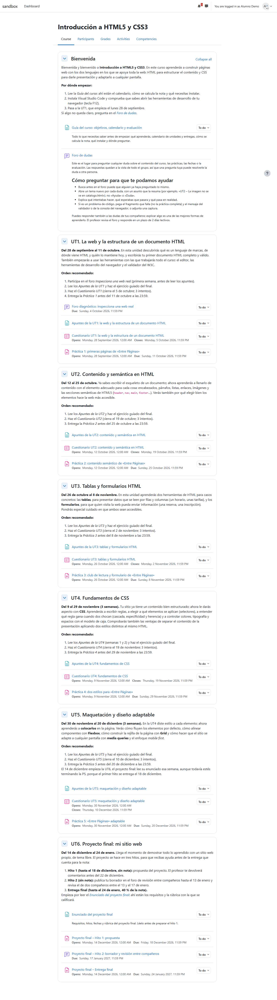
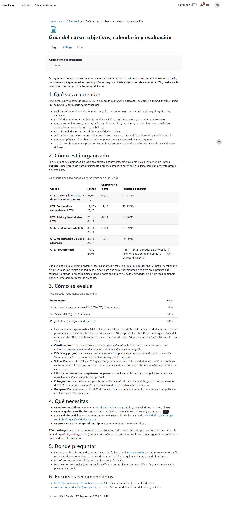
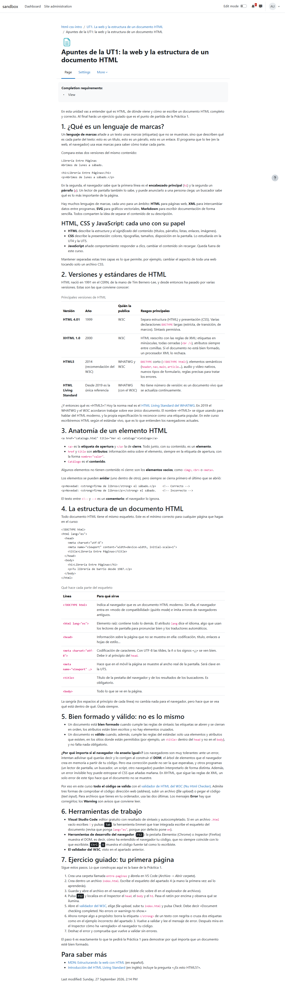
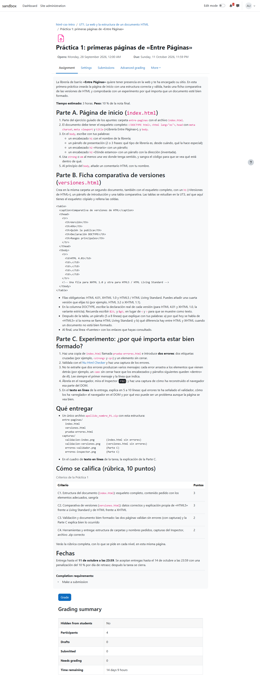
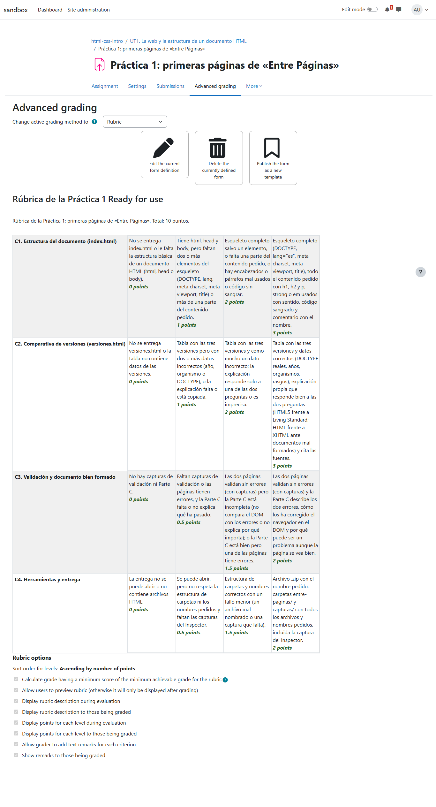
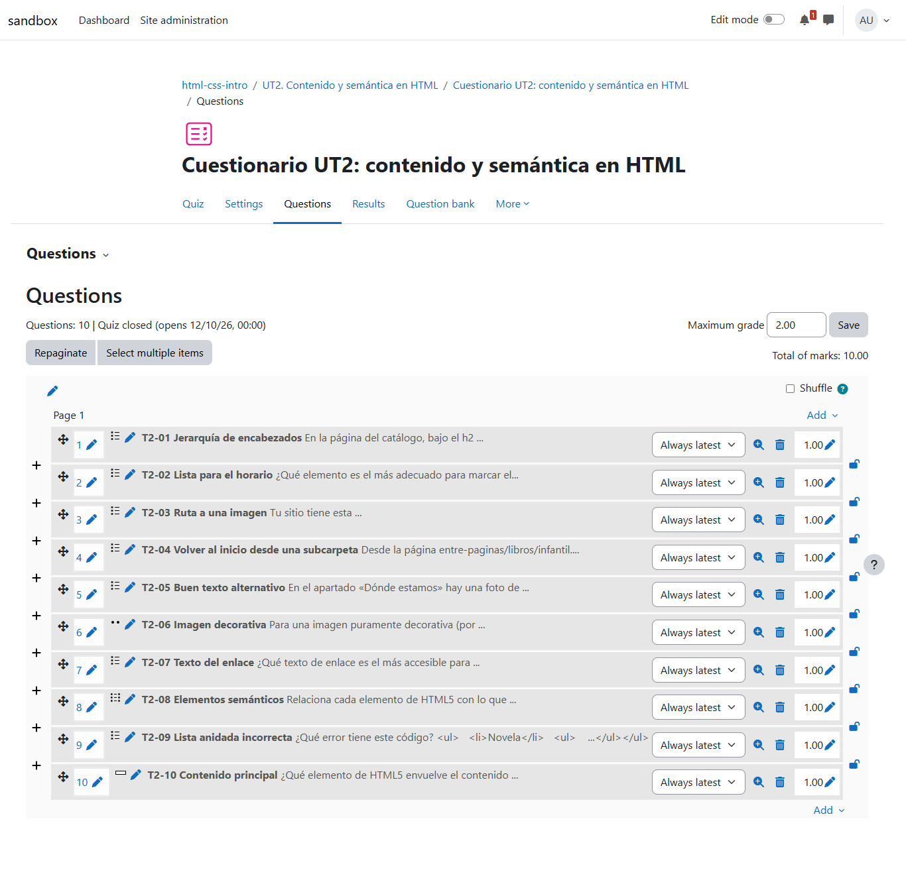
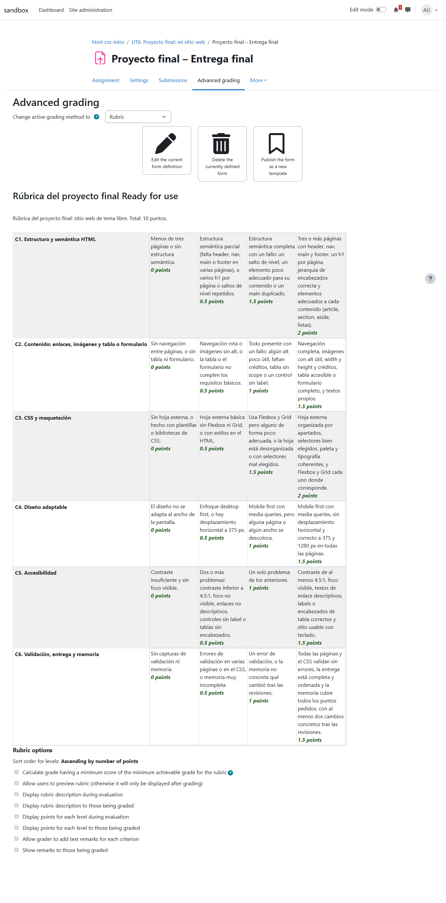

# Curso "Introducción a HTML5 y CSS3" construido por el agente

Simulación completa con `simulate-course`: a partir de una sola frase, teacher-agent redactó la programación didáctica y construyó en Moodle un curso de 6 unidades, con apuntes, cuestionarios, prácticas con rúbrica y un proyecto final por hitos. Es la primera construcción de un curso completo con las skills reorganizadas de la v0.4.0.

- **Fecha:** 27 sep 2026, 12:49–15:21 (hora local)
- **Entorno:** moodle-sandbox · Moodle 5.2 en Docker · `http://localhost:8081` · Docker 29.7
- **Curso:** `html-css-intro` (id 4), creado vacío con `npm run course`, con el profesor y los 4 alumnos del sandbox matriculados
- **Agente:** teacher-agent 0.4.0 (commit `74edbf9`) · agent-kit 0.6.0
- **Workspace:** nuevo, en el scratchpad, con `allowPracticeRunner: true` y `sources/` vacío
- **Encargo:** `run --mode guided --headless --task "Build the complete course described here with the course-building skill: Introducción a HTML5 y CSS3 para FP de grado superior (DAW, 1.º), en español"`
- **Aprobaciones:** `auto-approve.mjs` (solo sandbox), revisadas después, abajo

## Veredicto

**Superada con hallazgos.** El curso está completo, en orden y es de buena calidad: cada unidad tiene apuntes de verdad, un cuestionario de 10 preguntas con retroalimentación y una práctica con rúbrica en Moodle, todo ello unido por un hilo conductor (la web de una librería ficticia) y cerrado con un proyecto por hitos con revisión entre compañeros. Hubo 48 aprobaciones, una por publicación, y nada se publicó sin la suya. Los hallazgos son de orden, no de calidad:

- La programación se ató al currículo oficial de DAW sin que nadie lo pidiera, cuando la regla es que sea genérica.
- El libro de calificaciones y los encabezados se arreglaron al final, reeditando 21 elementos ya publicados.
- En la guía se publicaron compromisos en nombre del profesor que nadie había decidido.
- Una llamada al navegador se colgó 65 minutos, casi la mitad de la sesión.

## Qué se ejecutó

| Sesión | Duración | Acciones | Subagentes | Aprobaciones |
| --- | --- | --- | --- | --- |
| `explore` | 4,6 min | 35 | — | — |
| `run --task` (construcción) | 147,2 min, 65 de ellos colgado | 521 (6 de `Bash` en `practice-runner`, 36 `WebFetch` y 6 `WebSearch` del `researcher`) | `researcher` ×1, `pedagogy-reviewer` ×2, `practice-runner` ×1 | 48 |

Los subagentes:

- **`researcher`**: el currículo del módulo, el estado de HTML ("Living Standard") y del CSS en los navegadores (Baseline), el validador del W3C y su imagen Docker, y recursos en español. Lo guardó como `summaries/investigacion-curriculo-y-estado-html-css.md`.
- **`pedagogy-reviewer`**: revisó la programación y luego los planes de las 6 unidades. El agente aplicó sus propuestas: más semanas para CSS, una rúbrica propia por práctica, evidencias para criterios que no las tenían e hitos del proyecto reordenados alrededor de las vacaciones.
- **`practice-runner`**: validó con el Nu Html Checker en Docker la solución modelo de la P1 y el esqueleto de los apuntes. Los dos errores que la P1 pide provocar generan 8 mensajes en el validador, y el agente añadió una aclaración al enunciado (aprobación 13). No dejó contenedores al terminar.

## El curso construido

| Sección | Contenido | Calificable |
| --- | --- | --- |
| Bienvenida | Guía del curso (objetivos, calendario, evaluación, qué instalar, dónde preguntar), Foro de dudas | — |
| UT1. La web y la estructura de un documento HTML | Foro diagnóstico (P y R), apuntes, cuestionario, Práctica 1 + rúbrica | Cuestionario 2 · P1 10 |
| UT2. Contenido y semántica en HTML | Apuntes, cuestionario, Práctica 2 + rúbrica | 2 · 10 |
| UT3. Tablas y formularios HTML | Apuntes, cuestionario, Práctica 3 + rúbrica | 2 · 10 |
| UT4. Fundamentos de CSS | Apuntes, cuestionario, Práctica 4 + rúbrica | 2 · 10 |
| UT5. Maquetación y diseño adaptable | Apuntes, cuestionario, Práctica 5 + rúbrica | 2 · 10 |
| UT6. Proyecto final: mi sitio web | Enunciado, Hito 1 (solo comentarios), foro de borrador y revisión entre compañeros, Entrega final + rúbrica de 6 criterios | Entrega final 40 |

Lo comprobado en la base de datos:

- **Actividades:** 22 módulos, todos visibles y en el orden del plan.
- **Cuestionarios:** 5, de 10 preguntas cada uno (`sumgrades` 10, nota máxima 2, 3 intentos, cierre a mitad de unidad).
- **Rúbricas:** 6 tareas calificadas, cada una con su rúbrica "Ready for use" (4 criterios en las prácticas y 6 en el proyecto).
- **Hito 1:** calificación de tipo "solo comentarios", fuera del total.
- **Total del curso:** 100 (5 × 2 + 5 × 10 + 40), con agregación Natural.

*El curso visto por "Alumno Demo": cada sección abre con sus fechas y un "orden recomendado", y las actividades muestran sus fechas de apertura y cierre, que siguen el calendario de la guía.*

*La guía del curso. Fíjate en el apartado 3: explica cómo se pasa del total sobre 100 a la nota sobre 10 (añadido en la aprobación 46) y anuncia la penalización del 10 % por día y el plazo de 2 días para responder en el foro, dos compromisos que nadie decidió (hallazgo 3).*

*Apuntes de la UT1: explicaciones con ejemplos de código, tablas con encabezados y un ejercicio guiado que es el punto de partida de la Práctica 1. Sus encabezados empiezan ya en `h2`, tras la corrección de la aprobación 47.*

*La Práctica 1: contexto, tres partes, qué entregar y cómo se nombra, los criterios con sus puntos (los mismos que la rúbrica) y las fechas. La nota del paso 3 de la Parte C salió de la prueba con el validador en Docker.*

*La rúbrica de la P1 en "Advanced grading": 4 criterios con niveles descriptivos, visible para el alumnado antes de entregar.*

*Cuestionario UT2: 10 preguntas en orden T2-01 → T2-10, total 10 y nota máxima 2. Dejarlo así costó 65 minutos (hallazgo 4).*

*La rúbrica del proyecto final: 6 criterios que suman 10 puntos, escalados a los 40 de la tarea.*

## La programación didáctica

`knowledge/teaching-plan.md` tiene unas 1.700 palabras y está enlazada con una página por unidad (`topics/ut1…ut6`). La cabecera avisa de que todo es una propuesta y lleva 9 marcas **[PROPUESTA]** en las decisiones que son del profesor: alcance, horas, calendario, metodología, pesos y retrasos. Termina con una lista de lo que el profesor debe confirmar. La metodología es aprender haciendo con un hilo conductor ("Entre Páginas") y un proyecto final de tema libre.

**Pero no es genérica.** Sin normativa en `sources/` y sin que nadie la pidiera, el agente encargó al `researcher` la redacción literal de los resultados de aprendizaje y criterios de evaluación del módulo 0373 en el BOE, solo porque la descripción decía "DAW". La programación quedó atada al RD 405/2023: los criterios son los oficiales (RA1 g–h y RA2 a–h), el alcance se define como "el bloque HTML + CSS del módulo" y otras partes se dan por "trabajadas en otros bloques". Contradice la regla de `teaching-plan` que pidió el profesor ("genérico, sin normativa") → hallazgo 1.

## Las aprobaciones

Hubo 48, todas de un solo elemento o de un mismo cambio aplicado a varios, y cada resumen detallaba el contenido (las preguntas de cada importación una a una, los criterios y niveles de cada rúbrica). No se publicó nada sin aprobación.

1. Configuración del curso: fechas (el fin coincidía con el inicio), seguimiento de finalización y descripción.
2. Página "Guía del curso".
3. Foro de dudas.
4. Sección General → "Bienvenida", con su resumen.
5. Sección 1 → UT1, con su resumen.
6. Foro diagnóstico de la UT1.
7. Tema inicial del foro diagnóstico.
8. Apuntes de la UT1.
9. Cuestionario UT1, vacío.
10. Importación GIFT de las 10 preguntas de la UT1.
11. Práctica 1.
12. Rúbrica de la Práctica 1.
13. Aclaración en el enunciado de la P1 (fruto de `practice-runner`).
14. Sección 2 → UT2.
15. Apuntes de la UT2.
16. Cuestionario UT2, vacío.
17. Importación de las 10 preguntas de la UT2.
18. Práctica 2.
19. Rúbrica de la Práctica 2.
20. Sección 3 → UT3.
21. Apuntes de la UT3.
22. Cuestionario UT3, vacío.
23. Importación de las 10 preguntas de la UT3.
24. Práctica 3.
25. Rúbrica de la Práctica 3.
26. Sección 4 → UT4.
27. Apuntes de la UT4.
28. Cuestionario UT4, vacío.
29. Importación de las 10 preguntas de la UT4.
30. Práctica 4.
31. Rúbrica de la Práctica 4.
32. Sección 5 → UT5.
33. Apuntes de la UT5.
34. Cuestionario UT5, vacío.
35. Importación de las 10 preguntas de la UT5.
36. Práctica 5.
37. Rúbrica de la Práctica 5.
38. Sección 6 → UT6.
39. Enunciado del proyecto final.
40. Proyecto final – Hito 1 (sin nota).
41. Foro del Hito 2 (borrador y revisión entre compañeros).
42. Proyecto final – Entrega final.
43. Rúbrica del proyecto final.
44. ⚠️ Nota máxima de los 5 cuestionarios, de 10 a 2 (retrabajo, hallazgo 2).
45. ⚠️ Nota máxima de la Entrega final, de 10 a 40 (retrabajo, hallazgo 2).
46. ⚠️ Guía del curso: explicación del total sobre 100 (retrabajo, hallazgo 2).
47. ⚠️ Encabezados de 7 páginas, un nivel arriba (retrabajo, hallazgo 5).
48. ⚠️ Encabezados de las descripciones de 9 actividades (retrabajo, hallazgo 5).

Revisándolas como profesor, las habría aprobado todas salvo una matización: la 2, porque la guía publica compromisos en nombre del profesor (hallazgo 3). Las 44–48 son correctas, pero no deberían haber hecho falta.

## Hallazgos

| # | Hallazgo | Dónde se corrigió |
| --- | --- | --- |
| 1 | La programación se ató al currículo oficial (RD 405/2023, RA y CE literales del BOE) sin normativa en `sources/` ni petición del profesor: nombrar un título ("DAW") no es pedir su currículo. | `teaching-plan`: no buscar normativa salvo que el profesor la dé o la pida; un título o nivel describe al alumnado; objetivos y criterios propios, y como mucho una propuesta de alinearlos con el currículo oficial. |
| 2 | Pesos y escala decididos en la programación, pero las actividades se crearon con la nota máxima por defecto (10) y hubo que reeditar 6 elementos y la guía al final. El agente descubrió a mitad de construcción que el sitio solo ofrece la agregación "Natural" y que no tiene penalizaciones por retraso (las dos cosas son ciertas: `grade_aggregations_visible = 13` y sin `gradepenalty_enabled`). | `course-building`: el libro de calificaciones se decide antes de la primera actividad calificable, con la nota máxima de cada elemento según los pesos, y solo se promete una penalización si el sitio la tiene. `quiz-building`: nota máxima al crear el cuestionario. `explore`: ahora anota las agregaciones disponibles y si existen las penalizaciones. |
| 3 | La guía del curso publica compromisos del profesor que nadie decidió: "el profesor responde en el foro en 2 días lectivos", comentarios del hito 1 antes del 22/12 y HTML de partida en la P4 a quien lo pida. El agente los listó al final como pendientes, pero ya estaban publicados. | `publish-check` (aprobaciones): los compromisos en nombre del profesor quedan fuera de lo que leen los alumnos si no los decidió él, o se nombran uno a uno en la aprobación. |
| 4 | Un `browser_evaluate` trivial (leer el orden de las preguntas, tras un script que reordenaba con peticiones a `edit_rest.php`) se colgó **65 minutos** sin ningún límite de tiempo. Los timeouts de @playwright/mcp cubren acciones y navegación, no `page.evaluate`. | `quiz-building`: scripts de navegador cortos y síncronos. **Abierto:** hace falta un límite de tiempo por llamada a herramienta en agent-kit (o en su configuración de MCP) para que un cuelgue no pare la sesión. |
| 5 | Los encabezados del contenido empezaban en `h3`/`h4` bajo el `h1` que pone Moodle; `publish-check` lo detectó al final y hubo que reeditar 16 elementos. | `publish-check`: el nombre de la página o actividad ya es el `h1`, así que el contenido empieza en `h2`. |
| 6 | Solo el cuestionario UT1 tiene su página en `knowledge/activities/`; los de la UT2–UT5 tienen únicamente el `.gift`. | `quiz-building`: una página por cuestionario, aunque repita los ajustes de otro. |
| 7 | La descripción larga del Foro de dudas (con su propio encabezado) aparece entera en la portada del curso. | Aceptado: es legible y útil al principio; se deja a criterio del profesor. |

## Lo añadido al agente

- `plugin/skills/teaching-plan/SKILL.md`: no ir a buscar normativa por nombrar un título.
- `plugin/skills/course-building/SKILL.md`: el libro de calificaciones, decidido antes y comprobado después; penalizaciones solo si existen.
- `plugin/skills/publish-check/SKILL.md`: el contenido empieza en `h2`; compromisos en nombre del profesor.
- `plugin/skills/quiz-building/SKILL.md`: nota máxima al crear, scripts cortos y una página por cuestionario.
- `prompts/system/explore.md`: nuevo paso 4, que mira las agregaciones del libro de calificaciones y si hay penalizaciones por retraso.

## Qué no cubrió la prueba

- Ningún alumno entregó ni hizo los cuestionarios: no se probó la corrección con las rúbricas ni la retroalimentación de las preguntas vista tras un intento.
- El refuerzo de `teaching-plan` sobre normativa no se ha vuelto a probar: esta sesión cargó la versión anterior.
- `practice-runner` solo validó la P1; las soluciones modelo de la P2–P5 (CSS, diseño adaptable) no se comprobaron en contenedor.
- La sesión fue `--headless` y en modo `guided` con aprobación automática; no se probó `chat`.
