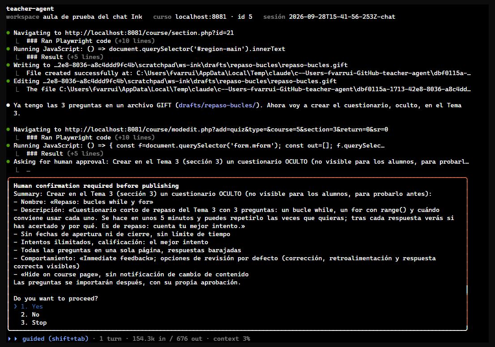
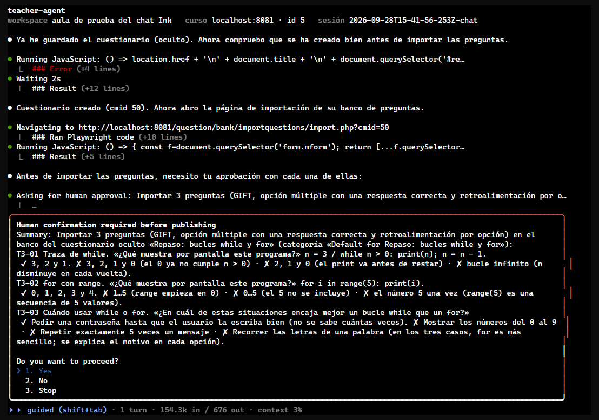
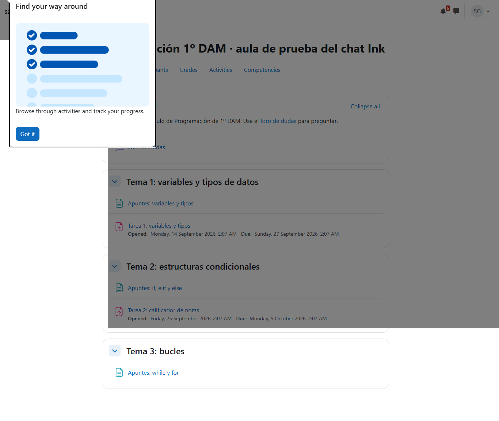
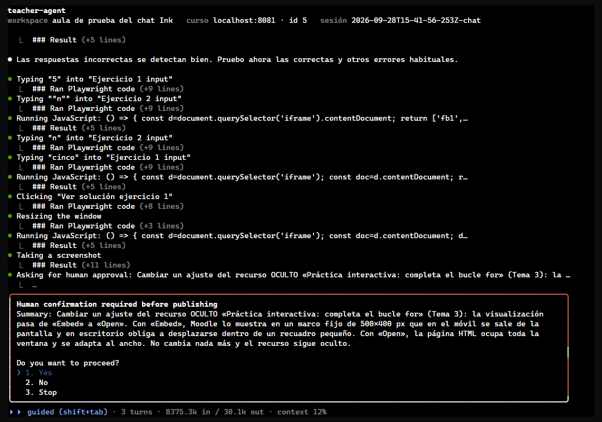
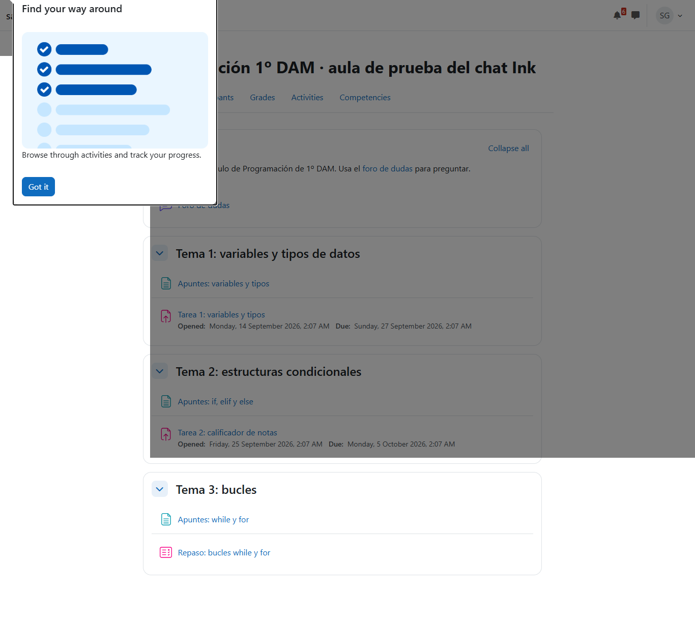

# Recursos probados ocultos en Moodle antes de mostrarlos

Prueba de la feature `draft-testing` (ADR-009): el agente construye cada recurso nuevo en `drafts/`, lo sube oculto al curso, lo prueba en Moodle y pide aparte mostrarlo, llevando la cuenta de lo que queda oculto en `knowledge/drafts.md`. Se probó con los dos casos de la ficha, en el chat a pantalla completa y en modo guided: un cuestionario, que un navegador no puede abrir por sí solo, y una actividad HTML interactiva. La actividad se dejó oculta a propósito.

- **Fecha:** 28 sep 2026, 16:41–17:08 (hora local)
- **Entorno:** moodle-sandbox · Moodle 5.2.3+ en Docker 29.6 · `http://localhost:8081`
- **Curso:** `dam-python-ink` (id 5), el aula de `2026-09-28T01-10-ink-chat-fullscreen`
- **Agente:** teacher-agent 0.4.0 sin publicar (sobre `b246cb6`, con la feature y la puerta de publicación) · agent-kit 0.10.0
- **Workspace:** el de las pruebas anteriores, creado antes de que existiera `drafts/` (la sesión la creó al arrancar)
- **Cuenta:** `profesor` del sandbox, `--headless`; aprobaciones respondidas a mano leyendo cada panel

## Veredicto

**Superada con hallazgos.** El agente siguió el flujo en los dos casos:

- construyó en `drafts/`;
- subió oculto, con aprobaciones que lo decían («OCULTO … para probarlo antes»);
- probó en Moodle;
- pidió aparte mostrarlo;
- apuntó y quitó lo pendiente de `drafts.md`.

Ninguna llamada a `Bash`, `Agent` ni Docker.

La prueba en Moodle encontró **dos fallos reales antes de que los vieran los alumnos**, que una vista previa local no habría visto:

- la importación GIFT quitó la sangría del código de dos preguntas;
- el HTML incrustado quedaba en un recuadro de 500×400 px que se salía en el móvil.

Como alumna, los recursos ocultos no aparecieron en ningún sitio.

Un hallazgo de la puerta de publicación quedó corregido durante la prueba: saltaba al iniciar sesión en Moodle.

## Qué se ejecutó

| Sesión | Duración | Acciones | Aprobaciones | Resultado |
| --- | --- | --- | --- | --- |
| `chat` (primera, parada al arrancar) | < 2 min | — | — | La puerta de publicación saltó dos veces en el login (hallazgo 1). Se paró sin haber publicado nada, se corrigió y se relanzó |
| `chat` en guided | 24,4 min | 194 (46 `evaluate`, 28 `click`, 22 `navigate`, 20 `Edit`, 4 `resize`, 2 `drop`, 1 `WebSearch`) | 8 | Cuestionario creado, probado y mostrado; actividad HTML creada, probada y dejada oculta |

## Esperado y obtenido

| Paso | Esperado | Cuestionario «Repaso: bucles while y for» | Actividad HTML «Práctica interactiva: completa el bucle for» |
| --- | --- | --- | --- |
| Construir | En `drafts/<slug>/` | `drafts/repaso-bucles/repaso-bucles.gift` | `drafts/completa-el-for/completa-el-for.html` |
| Subir | Oculto, con aprobación que lo diga, sin notificación | Aprobación 1 («un cuestionario OCULTO … "Hide on course page", sin notificación»); preguntas importadas con su propia aprobación (2), listando cada una | Aprobación 7 («Subir OCULTO … para probarlo antes») |
| Probar en Moodle | Usarlo como un alumno, como profesor | Vista previa con un intento completo, fallando una a propósito: **el código había perdido la sangría** (`print(n)` fuera del bucle); corregido en las dos preguntas (aprobaciones 3 y 4) | Respuestas correctas, incorrectas y no válidas, a 400 px de ancho: **incrustado quedaba en un marco de 500×400 px**; cambiado a «Open» (aprobación 8) |
| Mostrar | Aprobación aparte | Aprobación 6, que incluía el cambio de la descripción; antes, aprobación 5 para que no puntúe | El profesor pidió dejarlo oculto: queda en `drafts.md` |
| Como alumna, mientras está oculto | No aparece ni llega aviso | Ni en la página del curso ni en sus calificaciones; elemento de calificación oculto; 0 notificaciones | Ídem |
| Al cerrar | Aviso si queda algo oculto | — | «Hay recursos subidos ocultos a Moodle, aún sin mostrar a los alumnos: …/knowledge/drafts.md» |

Además, el agente avisó de algo que nadie le pidió revisar: con la agregación «Natural», el cuestionario habría sumado 10 puntos al total del curso. Preguntó si debía contar para la nota.

*La aprobación de subida dice «OCULTO (no visible para los alumnos, para probarlo antes)», lista los ajustes y anuncia que las preguntas irán aparte.*

*La importación, con cada pregunta, su respuesta correcta y el porqué de cada distractor.*

*Sara Gil con el cuestionario aún oculto: en el Tema 3 solo están los apuntes. El recuadro de arriba es el tour de bienvenida de Moodle.*

*Lo que encontró la prueba de la actividad HTML: incrustada no cabe en un móvil. Se pasa a «Open» con el recurso aún oculto.*

*Al final: el cuestionario ya visible en el Tema 3, y la actividad HTML, que sigue oculta, no aparece.*

## Aprobaciones, en orden

1. Crear el cuestionario oculto en el Tema 3, con sus ajustes → aprobada.
2. Importar las 3 preguntas (GIFT), cada una con su respuesta y sus distractores → aprobada.
3. Corregir la sangría del código de la pregunta T3-01 → aprobada.
4. Corregir la sangría del código de la pregunta T3-02 → aprobada.
5. Nota máxima del cuestionario a 0, para que no cuente (sigue oculto) → aprobada.
6. Mostrar el cuestionario y cambiar la última frase de su descripción → aprobada.
7. Subir oculto el recurso HTML → aprobada.
8. Pasar el recurso HTML oculto de «Embed» a «Open» → aprobada.

No se cambió nada en Moodle sin aprobación. Las dos preguntas de la puerta de publicación en la sesión parada eran el login.

## Hallazgos

1. **La puerta de publicación saltaba al iniciar sesión.** El agente escribe la contraseña con `submit: true` en un campo sin descripción, y la regla de «escribir y enviar» lo tomaba por un formulario que publica. *Corregido* en `src/publishGate.ts`: no cuenta un login (el texto es el secreto de la contraseña, o el campo es de usuario o contraseña) ni una búsqueda. Tres casos nuevos en `check-publish-gate.mjs`.
2. **La importación GIFT quita la sangría del código.** El agente lo encontró al probar y lo corrigió pregunta a pregunta. *Abierto:* el profesor pidió un validador determinista de GIFT (y de otros formatos) en vez de dejarlo al agente. Queda como ficha nueva.
3. **El saludo del chat decía «no hay recursos ocultos pendientes»** sin que hiciera falta. *Corregido* en `prompts/messages/chat-opening-teacher.md`: solo los menciona si los hay.
4. **`drafts.md` guardó una línea sobre el cuestionario ya mostrado** en vez de quitarlo. No es un elemento de lista, así que el aviso del cierre no se equivoca. *Aceptado:* la regla ya dice que se quita.

## Qué se añadió

- `drafts/` en el workspace: la crean `init` y cada sesión si falta, y el agente principal puede escribir en ella (`src/workspace.ts`, `src/agent.ts`).
- El aviso de borradores ocultos al cerrar la sesión (`src/agent.ts`).
- El flujo del borrador oculto en `plugin/skills/publish-check`; el GIFT pasa a `drafts/` en `quiz-building`, `course-knowledge.md` y `knowledge-migration.md`; `drafts.md` en el esquema de la base de conocimiento.
- `practice-runner` no sirve ficheros (`prompts/system/practice-runner.md`); el cierre de `run` nombra los borradores ocultos (`teacher-run.md`); el saludo del chat los menciona.
- ADR-009 y su línea en `principles.md`; README, CHEATSHEET y `architecture.md`.

## Qué no cubrió

- H5P, SCORM, libros y páginas de Moodle: el flujo es el mismo, pero no se probaron.
- `course-building` con una unidad entera oculta y mostrada con una sola aprobación.
- Una sesión nueva que retome un borrador pendiente de `drafts.md`: sí se comprobó el aviso del cierre, no el saludo de la sesión siguiente.
- La interfaz de Moodle en español.
