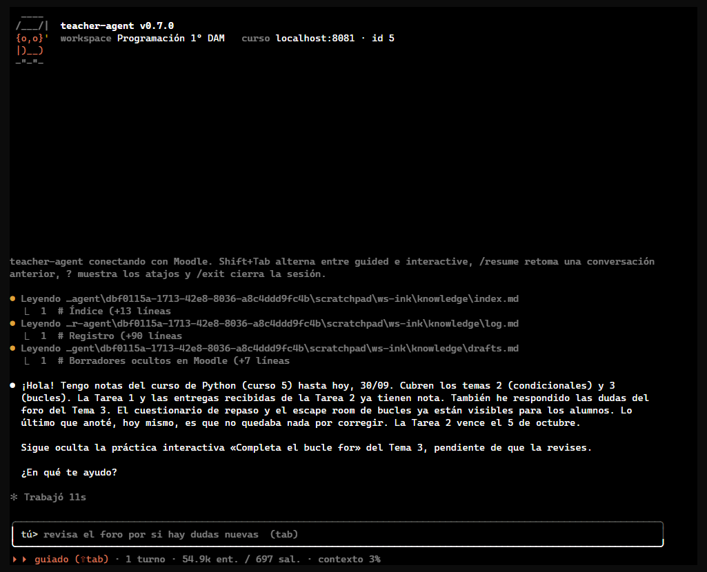
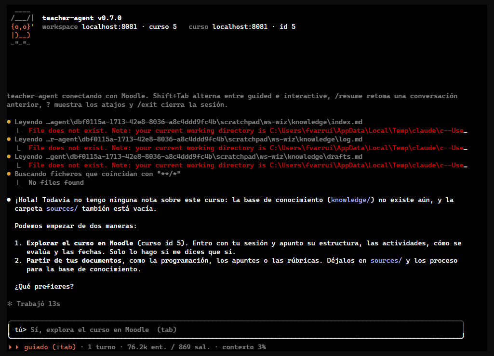

# Abrir Moodle solo cuando haga falta

| | |
| --- | --- |
| Fecha | 30 sep 2026, 14:52 UTC |
| Entorno | moodle-sandbox · Moodle 5.2 · Docker 29 |
| Curso | `dam-python-ink` (id 5), con base de conocimiento de sesiones anteriores; y el mismo curso en un workspace nuevo, sin notas |
| teacher-agent | 0.7.0 + los cambios de la ficha `browser-on-demand` ([#4](https://github.com/falkenslab/teacher-agent/issues/4)) |
| agent-kit | 0.13.0 |
| Cuenta | profesor del sandbox |
| Modo | `chat --headless`, guided, 120×45 |

## Veredicto

**Superada.** El chat saluda desde la base de conocimiento sin abrir el navegador, responde desde sus notas cuando basta (diciendo de cuándo son y ofreciendo comprobarlo) y solo entra en Moodle, e inicia sesión, cuando la pregunta necesita el estado real del curso. En un curso sin notas ofrece explorar o ingerir documentos y no navega hasta que se le dice que sí.

## Qué se ejecutó

| Sesión | Duración* | Llamadas | Del navegador | Primera del navegador |
| --- | --- | --- | --- | --- |
| Chat en el curso con notas (3 preguntas) | 92 s | 16 | 11 | a los 46 s, en la tercera pregunta |
| Chat en un workspace sin notas (saludo) | 5 s | 4 | 0 | — |

\* Del primer al último registro del `transcript.jsonl`; no incluye el tiempo del modelo antes de la primera herramienta.

## Esperado frente a lo que hizo

| Paso | Esperado | Lo que hizo |
| --- | --- | --- |
| Saludo | Resumir lo que sabe, sin navegador | Leyó `index.md`, `log.md` y `drafts.md` (3 lecturas) y resumió el curso «hasta hoy, 30/09», con la práctica oculta pendiente. 11 s; antes de este cambio, el saludo con inicio de sesión tardaba entre 54 y 147 s. |
| «¿Qué temas tiene el curso?» | Desde `knowledge/`, diciendo de dónde sale | Leyó `course-map.md` y listó los tres temas con sus recursos. Añadió que sus notas no dicen si hay más secciones y ofreció comprobarlo en Moodle. Sin navegador. |
| «¿Hay entregas pendientes de corregir?» | Iniciar sesión y mirar Moodle | Inició sesión (un formulario de 2 campos), abrió las tablas de calificación de las dos tareas y respondió con las cifras reales. |
| Curso sin notas | Ofrecer explorar o ingerir, sin navegar | Dijo que no tiene notas ni documentos y ofreció explorar el curso («solo lo hago si me dices que sí») o partir de `sources/`. Ninguna llamada al navegador. |

## Capturas

1. [Saludo sin navegador](assets/01-saludo-sin-navegador.png): solo lecturas de `knowledge/` encima del saludo.
2. [Los temas, desde las notas](assets/02-temas-desde-las-notas.png): responde sin navegador y ofrece comprobarlo en Moodle.
3. [Las entregas, en Moodle](assets/03-entregas-en-moodle.png): aquí sí abre las tablas de calificación.
4. [Curso sin notas](assets/04-curso-sin-notas.png): ofrece las dos maneras de empezar.

## Aprobaciones

Ninguna: la prueba no publicó nada, y nada se publicó sin aprobación.

## Hallazgos

Ninguno nuevo. El tema de colores de [#10](https://github.com/falkenslab/teacher-agent/issues/10) se ve en las capturas (viñetas ámbar, modo en naranja), que no se había podido ver con el spinner.

## Qué se cambió

- `prompts/messages/chat-opening-teacher.md`: saludar desde la base de conocimiento, sin navegador; sin notas, ofrecer explorar o ingerir.
- `prompts/system/teacher-chat.md`: no abrir el navegador al empezar; responder desde `knowledge/` cuando baste, diciendo de cuándo es; iniciar sesión justo antes de la primera acción que necesite Moodle; preguntar antes de navegar solo para explorar.
- `check-prompts.mjs`: el prompt del chat lleva la regla, y su mensaje inicial no manda iniciar sesión.

## Qué no cubrió

- El inicio de sesión manual (workspace sin usuario guardado) cuando la primera acción del navegador llega a mitad de conversación.
- `run` y `explore`, que siguen iniciando sesión al empezar (no cambian).
- Decir «sí» a explorar en el curso sin notas.
