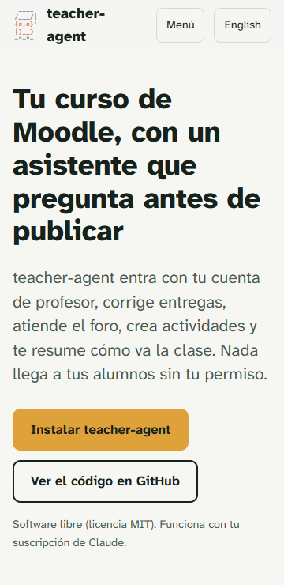
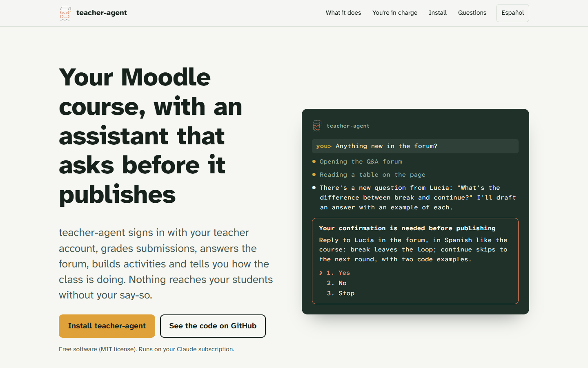

# Web promocional en español e inglés

| | |
| --- | --- |
| Fecha | 30 sep 2026, 15:35 UTC |
| Entorno | GitHub Pages (`https://falkenslab.github.io/teacher-agent/`) y, antes de publicar, un servidor local con la misma ruta; Chrome sin ventana manejado con Playwright; Lighthouse 12 |
| Páginas | `/` (español) y `/en/` (inglés) |
| teacher-agent | 0.8.0 + la ficha `promo-site` ([#14](https://github.com/falkenslab/teacher-agent/issues/14)) |
| Capturas del producto | moodle-sandbox · Moodle 5.2 · Docker 29, curso `dam-python-ink` (id 5) |

## Veredicto

**Superada.** Las dos páginas están publicadas, enlazadas entre sí y desplegadas por `pages.yml` desde `main`. En los seis anchos (y los móviles en horizontal) no hay desplazamiento horizontal ni nada cortado, y todos los botones y enlaces miden al menos 44 px. El menú y el selector de idioma funcionan con el dedo y con el teclado. Lighthouse da 100 en rendimiento, accesibilidad, buenas prácticas y SEO, en móvil y en escritorio, en las dos páginas.

## Qué se ejecutó

| Comprobación | Resultado |
| --- | --- |
| Playwright, 2 páginas × 8 tamaños (360×740, 740×360, 390×844, 844×390, 768×1024, 1024×768, 1440×900, 1920×1080): desplazamiento horizontal, imágenes cargadas, anclas, objetivos táctiles, tamaño del texto, menú y cambio de idioma | Sin problemas, tras dos arreglos (ver hallazgos) |
| Lighthouse 12, móvil y escritorio, las 2 páginas | 100 / 100 / 100 / 100 en las cuatro ejecuciones, tras alojar las fuentes en el sitio |
| La web publicada, 6 anchos | Fuentes propias cargadas, sin desplazamiento horizontal, `og:image` en el idioma de cada página |
| Imagen de la captura según el ancho | 720 px en los móviles en vertical; 1100 px en horizontal y en adelante (pantallas de densidad 2) |

## Diseño

Con `frontend-design` (de `anthropics/skills`), plan primero y revisión contra su lista de señales de página genérica:

- **Idea:** la pizarra del aula. El producto vive en una terminal, así que el elemento memorable de la portada es una conversación en HTML (no una imagen): se traduce, se adapta al móvil y la leen los lectores de pantalla.
- **Colores:** pizarra `#1f3129`, tiza `#f1f3ec`, papel `#f6f7f3` (blanco frío, no el crema que la guía marca como señal), tinta `#17221d` y el ámbar de la borla del búho `#dfa23a` (`#8a5a06` como texto sobre papel). El naranja del búho (`#d77757`), casi el acento de Anthropic que la guía cita como señal, se queda en el logo y en el borde del panel de aprobación, como en el producto.
- **Tipografía:** Atkinson Hyperlegible Next y Mono, diseñadas para leerse bien, servidas desde el propio sitio.
- **Estructura:** «Una semana con teacher-agent» de lunes a jueves (una secuencia real, por eso lleva días); «Tú decides» sobre la pizarra, a todo el ancho; los pasos de instalación numerados porque son una secuencia. Sin tarjetas iguales, sin etiquetas en mayúsculas ni flechas en los enlaces.
- **Movimiento:** uno, las líneas de la terminal apareciendo al cargar; nada con movimiento reducido.
- `theme-factory` no se usó: sus diez temas son genéricos y no parten del búho. `canvas-design` guió la imagen para redes (`og-es.png`, `og-en.png`, 1200×630).

## Capturas

1. [Móvil, 360 px](assets/01-es-360-movil.png): la portada.
2. [Móvil, 390 px, con el menú abierto](assets/02-es-390-menu.png).
3. [Tableta, 768 px](assets/03-es-768-tableta.png): la semana, con el día encima del texto.
4. [1024 px en horizontal](assets/04-es-1024-horizontal.png): «Tú decides», en columna hasta 56 rem.
5. [Escritorio, 1440 px, en inglés](assets/05-en-1440-escritorio.png): portada a dos columnas.
6. [Pantalla ancha, 1920 px, en inglés](assets/06-en-1920-pantalla-ancha.png): el contenido limitado a un ancho de lectura; el comando se desplaza dentro de su bloque.

## Hallazgos

| # | Hallazgo | Estado |
| --- | --- | --- |
| 1 | Hasta 1024 px había desplazamiento horizontal: la línea del comando de instalación ensanchaba la columna de su paso (los elementos de una rejilla no encogen por debajo de su contenido). | Corregido antes de publicar: `min-width: 0` en los hijos de las rejillas. |
| 2 | El logo de la cabecera medía 42 px de alto, bajo el mínimo táctil de 44. | Corregido antes de publicar. |
| 3 | Rendimiento en móvil de 89–90: la hoja de Google Fonts bloqueaba el primer pintado. | Corregido: las fuentes se sirven desde el sitio (licencia OFL), 100 en móvil y, de paso, la página no envía a Google la IP de cada visitante. |
| 4 | El título «Una semana con teacher-agent» se partía en el guion. | Corregido con un guion que no se corta. |
| 5 | Al preparar la captura en inglés, el resumen del panel de aprobación salía en el idioma del curso (español) y no en el de la conversación. | Corregido en el producto ([#15](https://github.com/falkenslab/teacher-agent/issues/15)); la captura de la web es posterior al arreglo. |
| 6 | `site/site.js` hizo fallar lint en CI (globales del navegador). | Corregido en `eslint.config.js`. |

## Qué no cubrió

- Lectores de pantalla reales (solo la auditoría de accesibilidad de Lighthouse y la estructura: encabezados, `lang`, textos alternativos, la conversación de la portada con su descripción).
- Safari y Firefox; solo Chrome.
- Vistas previas reales al compartir en redes (se comprobaron las etiquetas `og:` y la imagen publicada).
