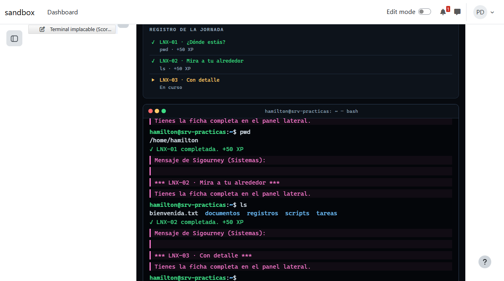

# Caja de herramientas de drafts/: un juego como SCORM y apuntes en PDF

| | |
| --- | --- |
| Fecha | 30 sep 2026, 16:03 UTC |
| Entorno | moodle-sandbox · Moodle 5.2 · Docker 29 |
| Curso | `dam-python-ink` (id 5), workspace con base de conocimiento |
| teacher-agent | 0.8.0 + la ficha `drafts-toolbox` ([#1](https://github.com/falkenslab/teacher-agent/issues/1)) |
| agent-kit | 0.13.1 |
| Cuenta | profesor del sandbox |
| Modo | `run --mode guided --headless`, aprobaciones respondidas por el arnés (solo en el sandbox) |

## Veredicto

**Superada con hallazgos.** El agente empaquetó el juego «Terminal implacable» como SCORM solo con la caja de herramientas y el navegador (ni `Bash`, ni subagentes, ni Docker), lo subió oculto, lo jugó entero en Moodle y la nota llegó al calificador. En otra sesión escribió unos apuntes, los convirtió a PDF con `drafts_pdf` y los subió ocultos como recurso Archivo. Las comprobaciones de límites están en `verify` (`check-drafts-toolbox.mjs`).

## Qué se ejecutó

| Sesión | Duración | Llamadas | Herramientas de drafts/ | Aprobaciones |
| --- | --- | --- | --- | --- |
| SCORM de «Terminal implacable» | 8 min | 70 | `drafts_fetch_site` ×2, `drafts_zip` ×1 | 1 (subir oculto) |
| Apuntes del Tema 3 en PDF | 4 min | 43 | `drafts_pdf` ×1 | 1 (subir oculto) |

Ninguna de las dos usó `Bash`, `Agent` ni Docker.

## Esperado frente a lo que hizo

| Paso | Esperado | Lo que hizo |
| --- | --- | --- |
| Descargar el juego | Todo lo que carga la página, en `drafts/` | `drafts_fetch_site`: 28 ficheros (0,24 MB), con `terminal-implacable/` y `shared/` como en la web, así que los enlaces relativos siguen funcionando |
| Puente | `scorm-bridge.js` y un gancho sin tocar la lógica del juego | El puente de `scorm-packaging` y un `scorm-hook.js` que envuelve `game.complete` y `game.finish` del motor: puntúa solo las tareas resueltas (no las saltadas), nunca baja la nota dentro de un intento, y dentro de Moodle oculta el enlace a los otros juegos, que no van en el paquete |
| Manifiesto y ZIP | `imsmanifest.xml` en la raíz del ZIP | `drafts_zip` sobre `package/`: el manifiesto en la raíz, lanzando `terminal-implacable/index.html` |
| Subirlo | Oculto, con aprobación, nota sobre 100 | Actividad SCORM oculta en la sección General (`visible 0`), «Highest grade», nota máxima 100 |
| Probarlo | Jugar como profesor y que la nota llegue | Jugó las tareas 1 y 2 a mano (nota 7, «incomplete») y después las 27 escribiendo la solución de cada una en la terminal del juego: en la base de datos, `cmi.core.score.raw` 100, `cmi.core.lesson_status` «completed» y 100 en `grade_grades` |
| Apuntes en PDF | Generados desde `drafts/` y subidos como Archivo | HTML de apuntes con lo que ya había en el curso (apuntes, foro, prácticas), `drafts_pdf` (8 páginas), subido con `browser_drop` como recurso Archivo oculto en el Tema 3; Moodle guarda el mismo fichero (126 634 bytes, `application/pdf`) |

## Capturas

1. [El juego dentro del reproductor SCORM de Moodle](assets/01-scorm-en-moodle.png): las dos primeras tareas completadas, en la prueba del propio agente.
2. [Los apuntes que se convirtieron a PDF](assets/02-apuntes-para-el-pdf.png) (su HTML en `drafts/`).

## Aprobaciones

Una por sesión, las dos para subir el recurso **oculto**. Nada se mostró a los alumnos.

## Hallazgos

| # | Hallazgo | Estado |
| --- | --- | --- |
| 1 | Los parámetros opcionales de las herramientas (`otherHosts`, `path`, `recursive`) eran obligatorios para el SDK: con `.default()` de zod, una llamada que los omitía se rechazaba. El agente lo sorteó pasándolos. | Corregido: `.optional()` y el valor por defecto en el código; queda anotado en `server.ts`. |
| 2 | El cuerpo de las respuestas no se puede leer después de cerrar el navegador: la primera versión de `drafts_fetch_site` no guardaba nada. | Corregido antes de la prueba: cada respuesta se lee al llegar. |
| 3 | Jugar las 27 tareas llevó al agente una llamada de casi 7 minutos (un script que va escribiendo cada solución). La prueba es completa, pero lenta; bastaba con dos o tres tareas y comprobar el informe de intentos. | Aceptado; `scorm-packaging` ya dice «play a step, leave, and check Reports». |

## Qué no cubrió

- Jugar como alumno (la SCORM está oculta); el intento y la nota son del profesor, que Moodle registra igual.
- Un SCORM 2004, un paquete H5P o IMS: la caja de herramientas los permite, pero no se probaron.
- `drafts_unzip` y los rechazos con el agente real; están cubiertos en `check-drafts-toolbox.mjs`.
