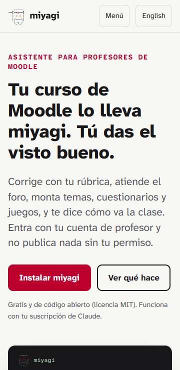
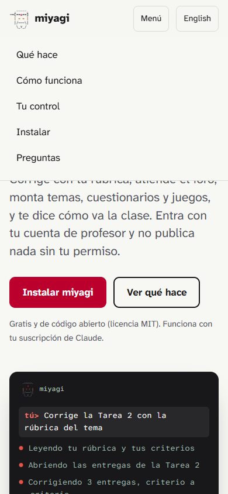
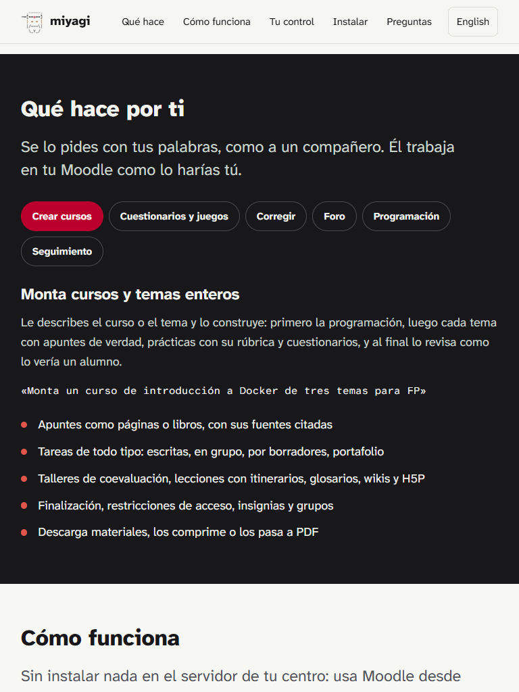
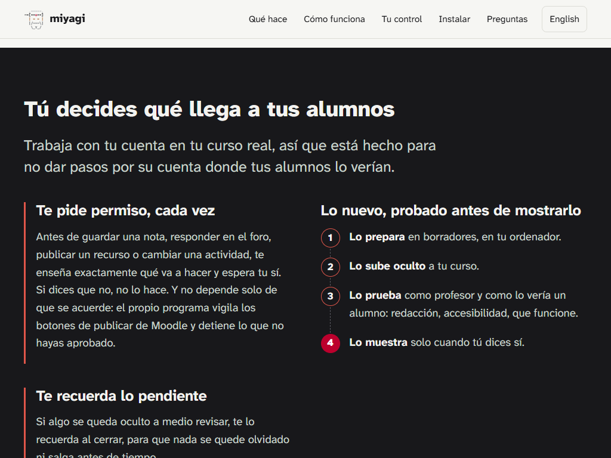
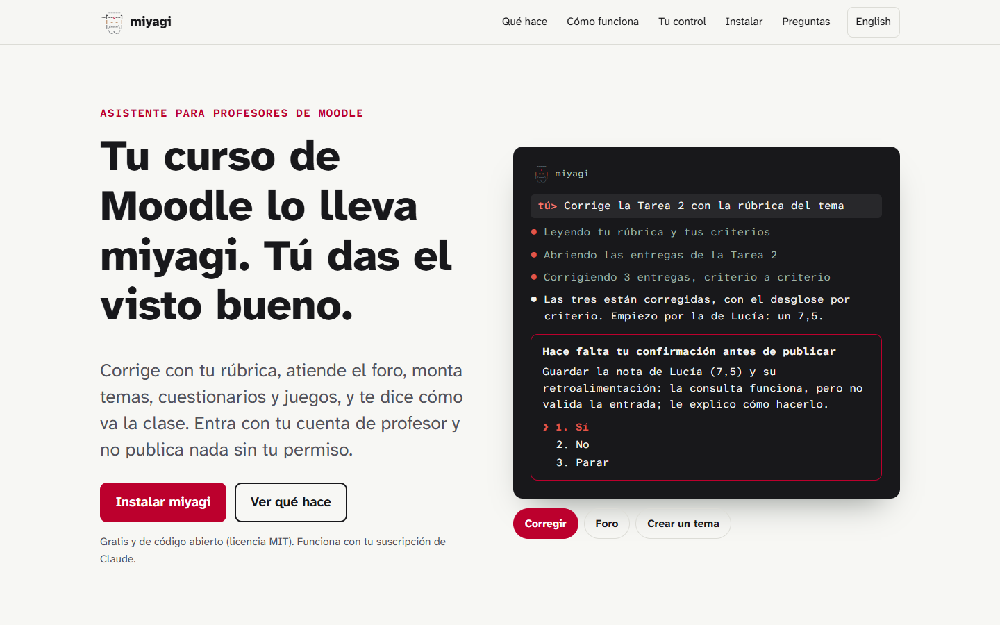
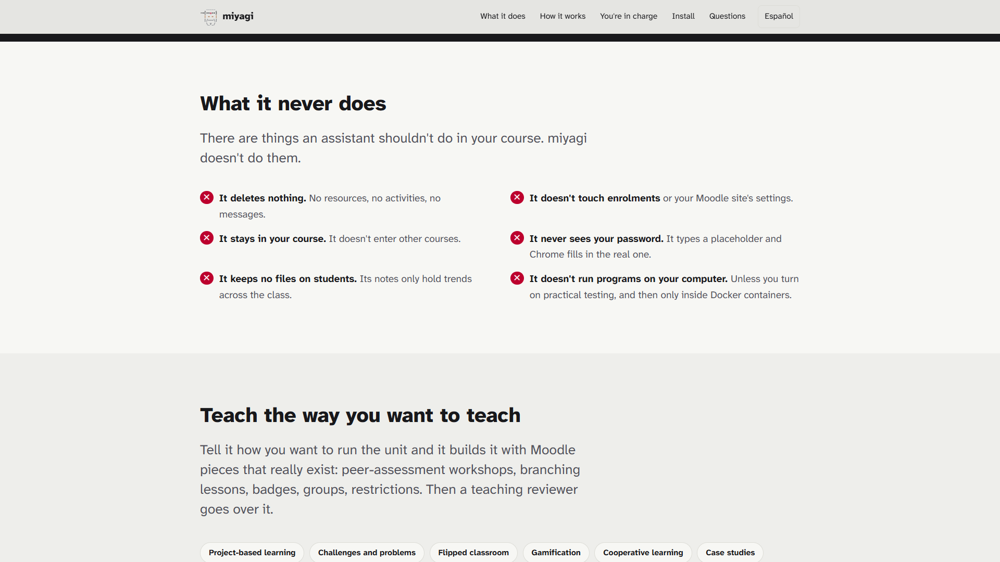

# Web rediseñada: una página con todo lo que hace miyagi

Comprobación de la web promocional rehecha con la ficha `site-redesign` ([#20](https://github.com/falkenslab/miyagi/issues/20)): una sola página por idioma, con 15 secciones, una terminal animada en la portada que acaba en la aprobación y la misma paleta y tipografía de antes. Se revisaron las dos páginas en local, con Playwright a ocho tamaños y con Lighthouse en móvil y escritorio.

| Dato | Valor |
| --- | --- |
| Fecha | 30 sep 2026, desde las 19:44 UTC |
| Entorno | Servidor estático local con la ruta de GitHub Pages (`/miyagi/`); Chrome sin ventana manejado con Playwright; Lighthouse 12 |
| Páginas | `/miyagi/` (español) y `/miyagi/en/` (inglés) |
| miyagi | 0.10.0 (`2318f99`) + los cambios de `site/` de esta ficha |
| Moodle | No interviene: la web no toca Moodle |

## Veredicto

**Superada con hallazgos.** En los ocho tamaños de las dos páginas no hay desplazamiento horizontal, todos los botones y enlaces fuera del texto miden al menos 44 px, no hay errores en la consola y se ve un único panel de pestañas. El menú, las pestañas (ratón y teclado), los tres ejemplos de la terminal y el cambio de idioma funcionan. Sin JavaScript se ven los seis paneles y el primer ejemplo completo; con movimiento reducido, el ejemplo sale entero de golpe. Lighthouse da 100 en accesibilidad y buenas prácticas, 97–100 en rendimiento y 92 en SEO, que solo pierde puntos por el `robots.txt` del servidor local. Hubo dos hallazgos y los dos están corregidos.

## Qué se ejecutó

| Comprobación | Resultado |
| --- | --- |
| Playwright, 2 páginas × 8 tamaños (360×740, 740×360, 390×844, 844×390, 768×1024, 1024×768, 1440×900, 1920×1080): desplazamiento horizontal, elementos que se salen, objetivos táctiles, imágenes rotas, errores de consola, paneles visibles | Sin problemas |
| Menú en móvil (390 px): abrir, seguir un enlace, que se cierre | Funciona |
| Pestañas de «Qué hace»: flecha derecha y Fin con el teclado | El foco y el panel cambian (`tab-cuestionarios`, `tab-seguimiento`) |
| Terminal: la escena «Crear un tema» elegida con su botón | Se ve, y a los 9 s están sus 6 líneas |
| Terminal al cargar, a 1440 px | A los 6 s están las 6 líneas y se para en la aprobación |
| Sin JavaScript (1024 px) | 6 paneles y 6 líneas del primer ejemplo visibles |
| Movimiento reducido | Todas las líneas con opacidad 1 desde el principio |
| Última versión leída de GitHub | «Última versión: v0.10.0 (30 de septiembre de 2026)» |
| Lighthouse 12, móvil y escritorio, las 2 páginas | Español: 98/100/100/92 en móvil y 100/100/100/92 en escritorio. Inglés: 97/100/100/92 en móvil y 100/100/100/92 en escritorio (rendimiento, accesibilidad, buenas prácticas, SEO) |
| `npm run lint` (incluye `site/site.js`) | Sin errores |

## Qué cambió en la web

- **Estructura:** hay 15 secciones:
  - portada con terminal;
  - el problema;
  - qué hace, en seis pestañas con verbos de profesor;
  - cómo funciona, en 3 pasos;
  - tu control, con el camino de lo nuevo (borrador → oculto → probado → visible);
  - lo que nunca hace;
  - metodologías;
  - memoria;
  - ayudantes;
  - a tu manera;
  - la captura real;
  - libre y probado;
  - instalar;
  - 8 preguntas;
  - un cierre.
- **Lo que antes no contaba:**
  - construir cursos y temas;
  - cuestionarios con GIFT y juegos SCORM;
  - rúbricas;
  - la programación didáctica y la alineación del aula con ella;
  - la auditoría;
  - las 13 metodologías de `teaching-methodologies`;
  - los tres ayudantes;
  - los tonos;
  - las habilidades y los atajos propios;
  - los informes de `tests/`.
- **De dónde sale cada afirmación:** de una skill de `plugin/skills/`, del README o de un informe de `tests/`. La frase de que el programa detiene lo que no se aprobó se apoya en el ADR-008, y se limitó a «vigila los botones de publicar de Moodle» porque la puerta no cubre todos los casos.
- **Qué no hay:** testimonios, logos ni cifras de uso.
- **Referencias:** logicoal.ai, por la terminal animada, y quince webs de agentes, cinco de ellas educativas. De ellas salen las pestañas por tarea, la sección de confianza, «lo que nunca hace» y las preguntas que responden objeciones.
- **Sin cambios:** la paleta hinomaru, las fuentes Atkinson, el logo y las imágenes `og-*.png`. El lema de esas imágenes, «pregunta antes de publicar», sigue siendo cierto.

## Capturas

*Móvil, 360 px: la portada. Encima va el título, y debajo la terminal con el primer ejemplo, que acaba en la aprobación.*

*Móvil, 390 px: el menú abierto, con sus cinco anclas.*

*Tableta, 768 px: «Qué hace por ti». Las pestañas bajan de línea en lugar de desplazarse; el panel muestra texto, petición de ejemplo y lista.*

*1024 px: «Tú decides qué llega a tus alumnos», con las reglas y el camino de lo nuevo en cuatro pasos.*

*Escritorio, 1440 px: portada a dos columnas, con los botones de los tres ejemplos bajo la terminal.*

*1920 px, en inglés: «What it never does» a dos columnas y el contenido limitado a su ancho de lectura.*

## Hallazgos

| # | Hallazgo | Estado |
| --- | --- | --- |
| 1 | Lighthouse marcó el contraste del «tú>» de la terminal: 3,91:1 (el rojo `#e0564a` sobre `#28282b`, a 13 px). Antes no contaba porque la terminal estaba oculta a los lectores de pantalla; ahora es texto legible. | Corregido en `site/styles.css`: `#f07a6f`, unos 5,4:1. |
| 2 | La frase «miyagi se encarga de esa parte. Tú decides…» se coloreaba con `::first-line`, así que según el ancho «Tú» salía en rojo. | Corregido: el rojo va en un `span` con la primera frase, en las dos páginas. |

No hubo nada que llevar a `plugin/skills/` ni a `prompts/`: el cambio es solo de la web.

## Qué no cubrió

- La web publicada en GitHub Pages: se comprobará tras el despliegue de `pages.yml`, junto con su `robots.txt`.
- Lectores de pantalla reales (solo la auditoría de Lighthouse y la estructura: encabezados, `lang`, textos alternativos, el patrón ARIA de las pestañas).
- Safari y Firefox; solo Chrome.
- El modo oscuro, revisado solo en capturas de tres secciones, sin auditoría de contraste.
