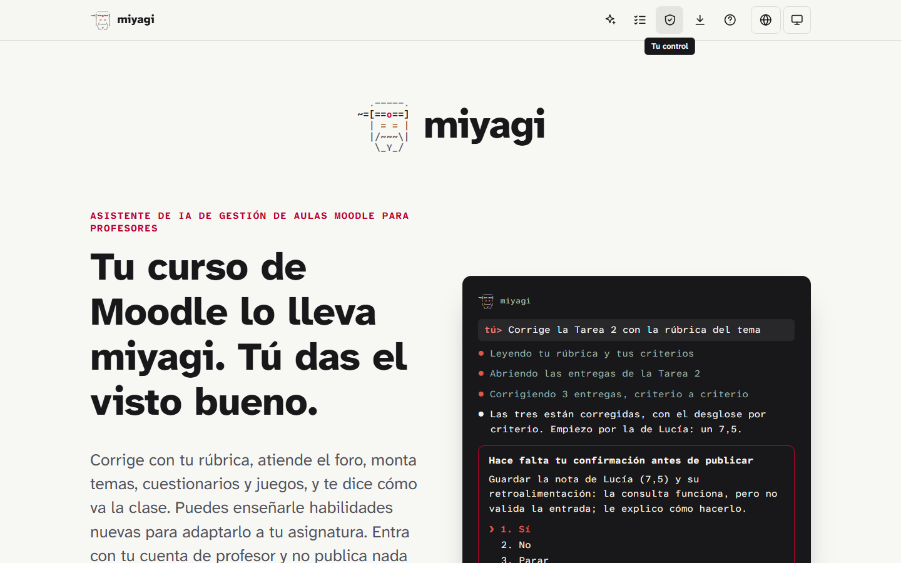
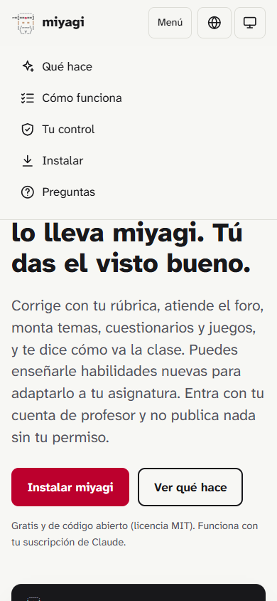
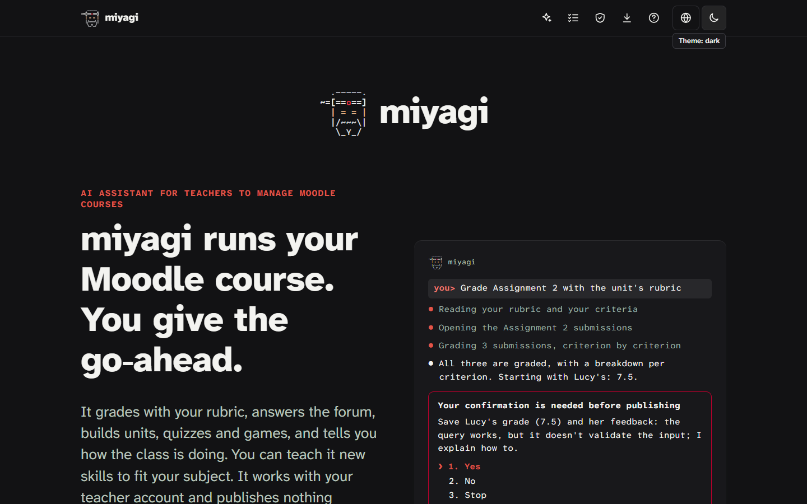
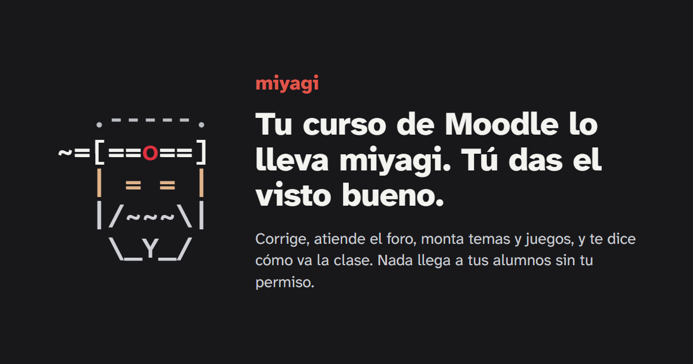

# Web: correcciones de la revisión

Comprobación de las correcciones que pidió el profesor sobre la primera versión de la web rediseñada ([informe anterior](../2026-09-30T19-44-site-redesign/README.md), ficha `site-redesign`, [#20](https://github.com/falkenslab/miyagi/issues/20)):

- **0.2** Menú con iconos y tooltip.
- **0.3** Idioma con icono.
- **0.4** Selector de tema: claro, oscuro o sistema.
- **1.0** Logo grande centrado.
- **1.1** Etiqueta nueva.
- **1.3** Entradilla con las habilidades propias.
- Imágenes para redes con el titular de la página.

| Dato | Valor |
| --- | --- |
| Fecha | 30 sep 2026, desde las 20:45 UTC |
| Entorno | Servidor estático local con la ruta de GitHub Pages (`/miyagi/`, y `?theme=dark` para forzar el tema oscuro); Chrome sin ventana manejado con Playwright; Lighthouse 12 |
| Páginas | `/miyagi/` (español) y `/miyagi/en/` (inglés) |
| miyagi | 0.10.0 (`bf4d66a`) + las correcciones de `site/` |

## Veredicto

**Superada.** Las 16 combinaciones de página y tamaño siguen sin desplazamiento horizontal, sin objetivos táctiles de menos de 44 px y sin errores de consola. El tooltip aparece al pasar el ratón y con el foco del teclado. El selector de tema recorre sistema → claro → oscuro → sistema y recuerda la elección al recargar. Lighthouse da 100 en accesibilidad en claro y en oscuro, en móvil y escritorio y en las dos páginas. Esa auditoría del modo oscuro quedaba pendiente en el informe anterior.

## Qué se ejecutó

| Comprobación | Resultado |
| --- | --- |
| Playwright, 2 páginas × 8 tamaños: lo mismo que en el informe anterior | Sin problemas |
| Menú, pestañas con teclado, ejemplos de la terminal, sin JS, movimiento reducido | Igual que antes: funcionan |
| Tooltip del enlace «Tu control» al pasar el ratón (1440 px) | `display: block`, texto «Tu control» |
| Nombre accesible de los enlaces del menú | «Qué hace \| Cómo funciona \| Tu control \| Instalar \| Preguntas» (el texto sigue en el enlace, oculto a la vista en pantallas anchas) |
| Selector de tema, con el sistema en claro | Sistema (fondo `#f7f7f4`) → claro → oscuro (`#121214`) → recarga: sigue en oscuro → sistema |
| Logo de la portada | Centrado: su centro en x = 720 de 1440 |
| Lighthouse 12, claro y oscuro × móvil y escritorio × 2 páginas | Accesibilidad y buenas prácticas 100 en las ocho; rendimiento 98–100; SEO 92 solo por el `robots.txt` del servidor local (100 en la web publicada) |
| `npm run lint` | Sin errores |

## Qué cambió

- **Cabecera:** cada enlace del menú es un icono con su texto oculto a la vista y un tooltip con el mismo texto. En el móvil, el menú desplegable muestra el icono y el texto. El idioma es un globo con tooltip («English» o «Español»). El tema es un botón que cambia de icono: pantalla para sistema, sol para claro y luna para oscuro.
- **Logo:** ahora va dentro de la página como símbolo SVG coloreado con variables del tema, no como ``. Como imagen solo seguía el modo del sistema, así que con «oscuro» elegido a mano en un sistema claro la cinta habría salido negra sobre negro. En la terminal lleva siempre los colores de fondo oscuro. El favicon sigue siendo `assets/miyagi.svg`.
- **Tema:** un script en el `<head>` aplica la elección guardada antes de pintar la página, así que no hay parpadeo. Sin JavaScript el botón no aparece y la página sigue al sistema.
- **Textos:**
  - etiqueta «Asistente de IA de gestión de aulas Moodle para profesores»;
  - la entradilla añade «Puedes enseñarle habilidades nuevas para adaptarlo a tu asignatura»;
  - en inglés, «go‑ahead» lleva un guion que no se corta.
- **Redes:** `og-es.png` y `og-en.png` repiten el titular de la página. `og:title` y `og:description` son el titular y la entradilla. La imagen se enlaza con `?v=2` para que WhatsApp no sirva la antigua de su caché.

## Capturas

*1440 px: el menú de iconos con el tooltip «Tu control», el globo del idioma, el botón del tema y el logo grande centrado sobre la portada.*

*390 px: en el menú desplegable, cada enlace lleva icono y texto; el idioma y el tema quedan como iconos en la barra.*

*1440 px en oscuro: el logo cambia de colores con el tema y el tooltip dice «Theme: dark».*

*La imagen para redes en español, con el mismo titular que la página.*

## Hallazgos

| # | Hallazgo | Estado |
| --- | --- | --- |
| 1 | El logo como `` no sigue el tema elegido a mano, solo el del sistema. | Corregido antes de publicar: símbolo SVG en la página con los colores del tema. |
| 2 | «go-ahead» se partía en el guion, en la imagen para redes y en el titular en inglés. | Corregido con un guion que no se corta. |

## Qué no cubrió

- La vista previa real en WhatsApp: se comprueba al compartir el enlace publicado.
- Safari y Firefox; lectores de pantalla reales.
