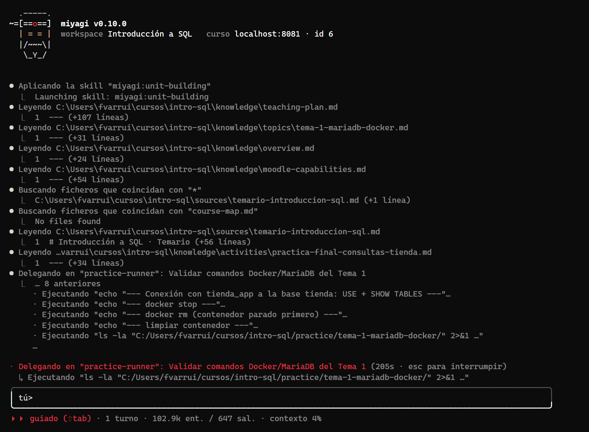
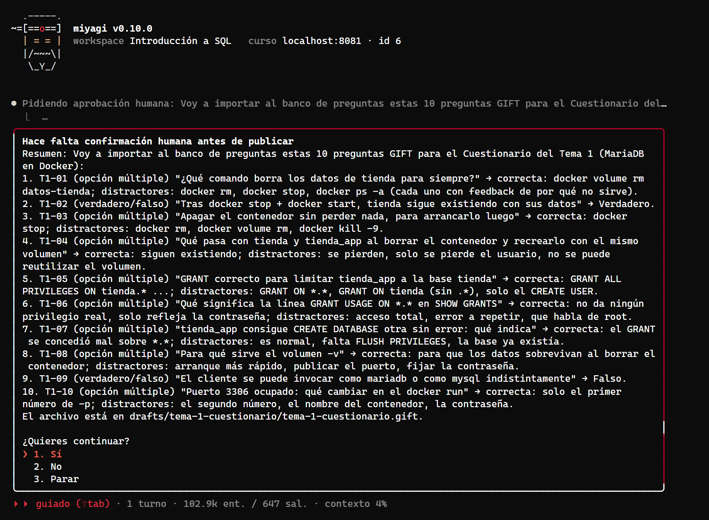
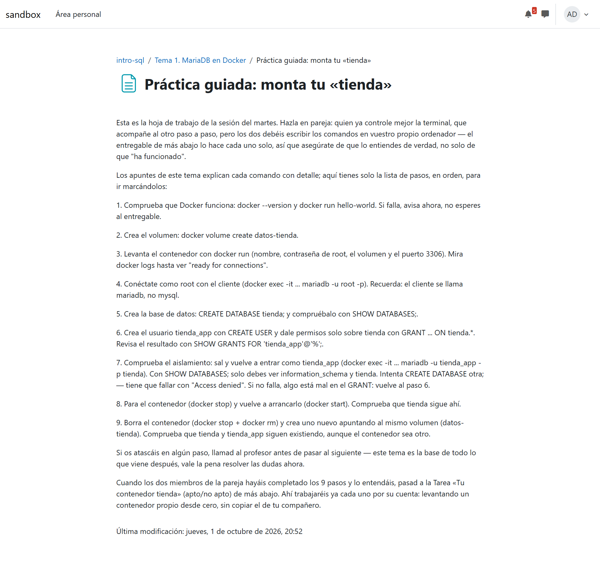
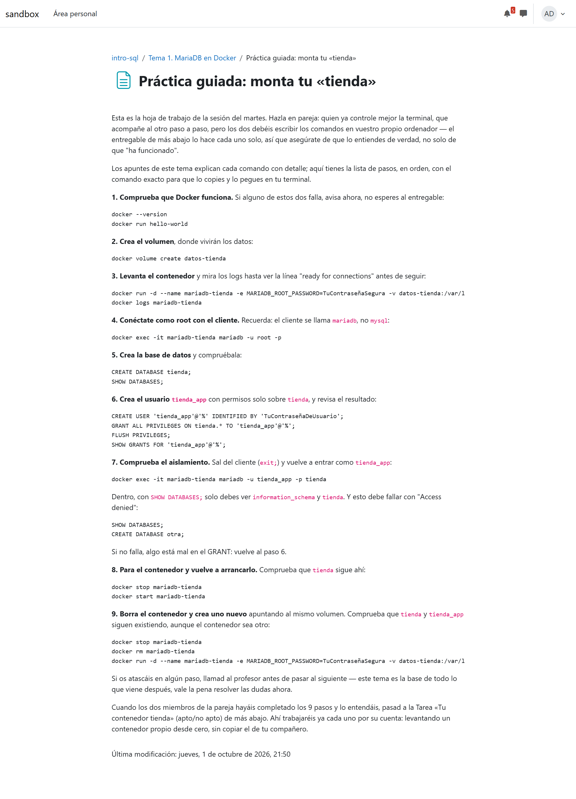
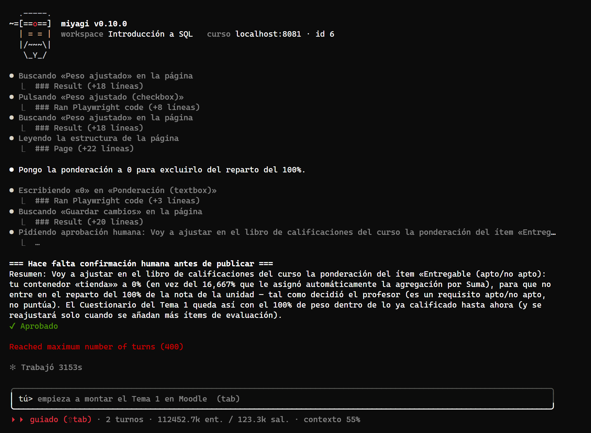
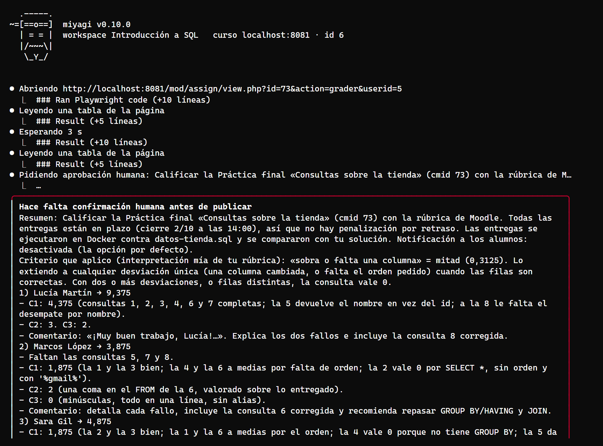
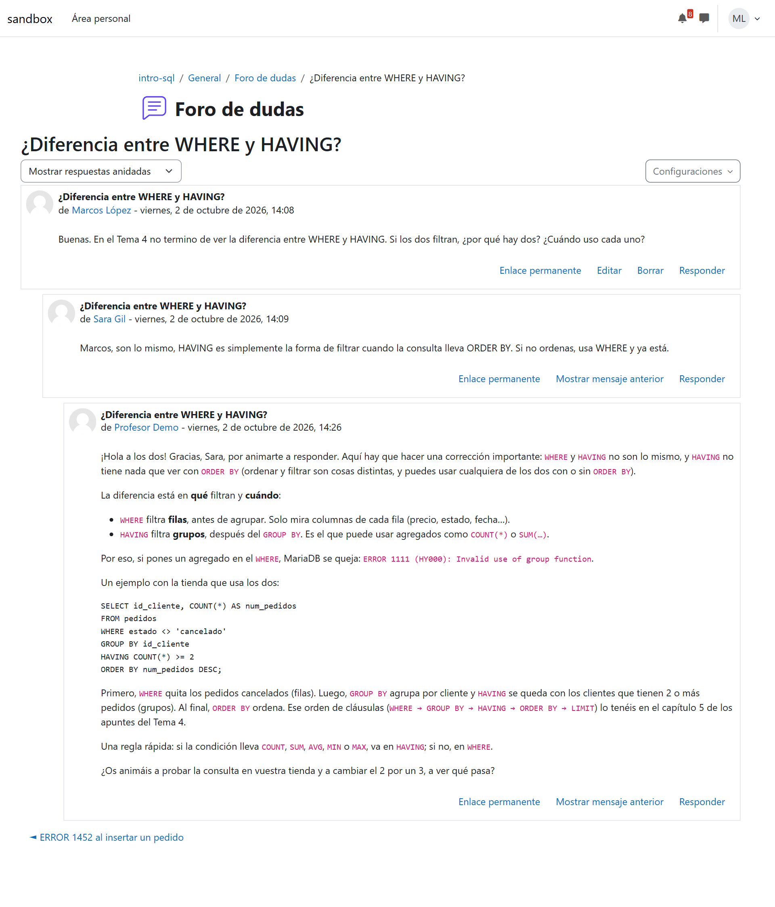
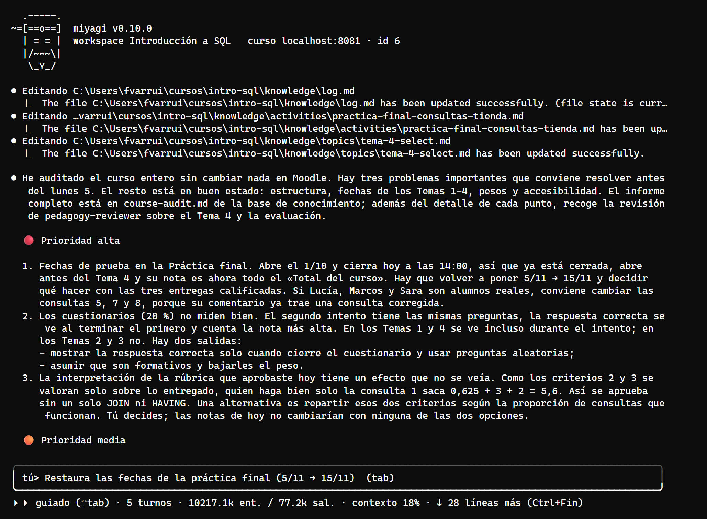
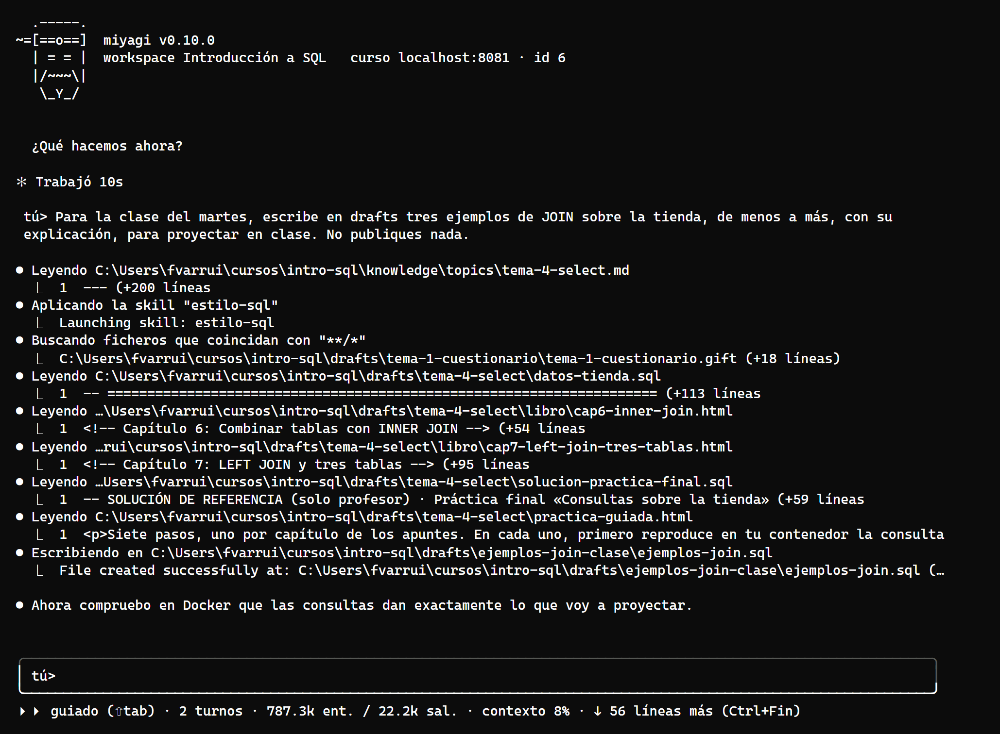

# Un aula de Introducción a SQL, de cero, para la documentación

Prueba de extremo a extremo hecha para el tutorial de casos de uso del sitio de documentación (#22). miyagi monta y lleva un aula de «Introducción a SQL» en moodle-sandbox, partiendo de un curso vacío: `init`, `explore`, `ingest` del temario y la rúbrica, programación didáctica con revisión pedagógica, cuatro temas (MariaDB en Docker, DDL, DML y consultas) con prácticas probadas en Docker, corrección de la práctica final con rúbrica, foro, seguimiento, auditoría y una habilidad propia. El chat se manejó tecla a tecla desde una pseudoterminal y se capturó como imagen; Moodle se capturó como profesor y como alumno.

- **Fecha:** 1 oct 2026, 20:03 – 2 oct 2026, 15:33 (hora local), con una pausa de la noche a la mañana por el límite de gasto de la cuenta de Claude
- **Entorno:** moodle-sandbox · Moodle 5.2.3+ en Docker 29.6 · `http://localhost:8081` · Windows 11; paquete de idioma `es` instalado y el curso forzado a español; opcache ampliado a 100 000 ficheros (el sandbox tiene 57 754 y lo tenía en 10 000)
- **Curso:** `intro-sql` (id 6), «Introducción a SQL», creado vacío con `npm run course`, con la cuenta `profesor`, `alumno` y los tres alumnos de `activity` (Lucía Martín, Marcos López, Sara Gil)
- **Agente:** miyagi 0.10.0 sin publicar (árbol de trabajo sobre `bb38fa7`, con las correcciones de esta prueba aplicadas sobre la marcha) · agent-kit 0.13.1
- **Workspace:** `C:\Users\fvarrui\cursos\intro-sql`, tono cercano, español, `allowPracticeRunner: true`, `headless: true`; en `sources/` un temario de 6 semanas y la rúbrica de la práctica final (escritos para la prueba)
- **Aprobaciones:** las de `init` a la programación y las del Tema 1 hasta su primera mitad, a mano; desde ahí, un bucle que capturaba, registraba y aprobaba cada panel (solo sandbox), revisado después. Las del arreglo de formato y las de la corrección se leyeron antes de seguir
- **Herramientas:** `tools/` (driver de la pseudoterminal, bucle de aprobaciones, capturas de Moodle y acciones de alumno)

## Veredicto

**Superada con hallazgos.** miyagi construyó un curso completo y coherente con la programación: 4 temas, 25 capítulos de apuntes, 5 páginas, 5 tareas (3 con rúbrica), 4 cuestionarios de 10 preguntas importados en GIFT, un foro y una guía del curso, con los pesos del calificador como dice la programación. Todo lo práctico lo ejecutó antes en Docker. La corrección dio a cada entrega la nota que merecía, con una retroalimentación útil, y la respuesta en el foro corrigió con respeto la respuesta equivocada de una compañera.

Los hallazgos serios fueron de proceso, no de contenido:

- **Borrados sin preguntar.** Al reimportar unas preguntas mal escapadas, borró preguntas de un cuestionario (oculto, suyas y recién creadas) y el vigilante lo dejó pasar porque seguía vigente una aprobación de diez minutos antes. Corregido en el vigilante.
- **Temas 2 y 3 publicados sin el flujo de borradores ocultos.** En el Tema 1 y el 4 creó cada pieza oculta y pidió permiso para mostrarla; en los temas 2 y 3 las guardó visibles y el vigilante tuvo que parar cada guardado (22 veces) sin el resumen de una aprobación normal. Se lo dijimos y lo corrigió. Abierto.
- **Formato perdido en el editor** de Moodle (los comandos como texto normal). Corregido en la skill.

## Qué se ejecutó

| Sesión | Qué | Duración | Llamadas | Navegador | Aprobaciones | Subagentes |
| --- | --- | --- | --- | --- | --- | --- |
| `explore` | Desde `miyagi init` | 7,9 min | 48 | 43 | 0 | 0 |
| `ingest` | Temario y rúbrica | 3,1 min | 25 | 0 | 0 | 0 |
| chat 1 | Programación didáctica | 8,3 min | 56 | 0 | 0 | 1 |
| chat 2 | Tema 1, y arreglo de formato de la práctica y el libro | 108,8 min | 567 | 495 | 10 | 4 |
| chat 3 | Temas 2 y 3, y su corrección (retomado con `--continue`) | 828,6 min de reloj, con la noche en medio | 530 | 392 | 3 | 6 |
| chat 4 | Tema 4, foro de dudas y pesos | 100,2 min | 270 | 112 | 12 | 3 |
| chat 5 | Corrección, foro, seguimiento, auditoría y guía | 73,1 min | 210 | 118 | 5 | 2 |
| chat 6 | Habilidad propia `estilo-sql` | 5,0 min | 28 | 0 | 0 | 1 |

El Tema 1 agotó el límite de 400 turnos de una sesión y bastó con decirle que siguiera. La cuenta de Claude llegó dos veces a su límite de gasto (una noche y una hora); con un token nuevo siguió donde lo había dejado.

## Esperado y obtenido

### Las piezas del curso

| Pieza | Esperado | Obtenido |
| --- | --- | --- |
| Programación | Criterios, calendario y diversidad, revisada | CE1.1–CE5.3, 6 semanas desde el 5/10 (martes y jueves), diversidad; el revisor pedagógico cambió el calendario de la semana 6 |
| Prácticas | Comprobadas antes de publicar | Todas ejecutadas en MariaDB 11.8.9 por el probador; su informe trajo detalles reales (arranque de 6–14 s, cliente `mariadb`, aviso de `io_uring`) |
| Cuestionarios | 10 preguntas en GIFT por tema | 4 × 10, en orden, un punto cada una |
| Práctica final | La rúbrica de `sources/` en Moodle | 8 criterios de 0/0,3125/0,625 más uso de SQL (0–3) y legibilidad (0–2); dijo qué niveles redactó él |
| Pesos | 20/15/15/50 | Ajustados con aprobación |
| Memoria | Sin nombres de alumnos | 23 páginas, 176 enlaces, 0 rotos, 0 páginas con un nombre (`check-knowledge.mjs --names`) |

*Antes de escribir los apuntes del Tema 1, el probador ejecuta cada paso en un contenedor `mariadb:11`.*

*Cada pregunta con su respuesta correcta y sus distractores, antes de existir en Moodle.*

*Antes y después: tecleado en el editor de Moodle, el contenido perdía los bloques de código; rehecho desde la vista de código fuente.*

*«Reached maximum number of turns (400)» a mitad del Tema 1.*

### La corrección

| Alumno | Entrega | Esperado | Nota | Comprobado en la BD |
| --- | --- | --- | --- | --- |
| Lucía Martín | Las 8, bien escritas | Alta | 9,375: la 5 devuelve el nombre en vez del id, la 8 sin desempate | 9.37500 |
| Marcos López | 5 consultas, minúsculas, coma en el `FROM` | Baja | 3,875 | 3.87500 |
| Sara Gil | Agregado en `WHERE`, `INNER` por `LEFT`, sin `GROUP BY` | Baja-media | 4,875 | 4.87500 |
| Alumno Demo | Sin entrega, plazo vencido | 0 | 0, «No se ha recibido entrega» | 0.00000 |

Las entregas se ejecutaron antes en un MariaDB con los datos de la tienda (también lo hice yo: la de Lucía devuelve lo mismo que la solución salvo esos dos detalles, la de Sara da `ERROR 1111` en la 5). Para poder corregir, las fechas de la práctica final se movieron en la base de datos del sandbox; miyagi detectó que no coincidían con su programación y lo dijo, y al final las devolvió a su sitio con aprobación.

*Una aprobación con cada alumno, su desglose y la interpretación de la rúbrica donde no era explícita.*

### El foro

Dos hilos: el `ERROR 1452` de Lucía (sin respuesta) y la duda de Marcos sobre `WHERE` y `HAVING`, con una respuesta equivocada de Sara. Esperado: una pista a Lucía sin resolverle el ejercicio, y una corrección respetuosa a Sara. Obtenido: exactamente eso, en una aprobación con los dos textos completos, y la observación de que la confusión es la misma que apareció al corregir.

*Agradece a Sara, corrige la idea con un ejemplo sobre la tienda y propone probarlo.*

### Seguimiento, auditoría y habilidad propia

El seguimiento separó datos de interpretación, no publicó avisos y dejó `progress.md` sin nombres. La auditoría encontró 12 puntos; el más útil, que la interpretación de la rúbrica aprobada ese día dejaba aprobar con una sola consulta correcta (5,6). La habilidad `estilo-sql` se cargó sola al pedirle ejemplos de JOIN, y el SQL la siguió.

## Aprobaciones, en orden

1. Nombre y resumen de la sección del Tema 1.
2. Mostrar el libro de apuntes del Tema 1 (6 capítulos).
3. Mostrar la práctica guiada del Tema 1.
4. Crear la escala «Apto / No apto».
5. Mostrar el entregable del Tema 1.
6. Importar 10 preguntas GIFT (Tema 1).
7. Mostrar el cuestionario del Tema 1.
8. Peso 0 % del entregable del Tema 1.
9. Rehacer la práctica guiada con bloques de código.
10. Rehacer el libro del Tema 1 con bloques de código.
— Temas 2 y 3: libros, prácticas, tareas y cuestionarios guardados visibles sin pedir aprobación; el vigilante paró cada guardado (22 paneles «Publicación sin aprobación previa», aprobados por el bucle).
— Borrado de las preguntas importadas del Tema 2 y, después, de las del cuestionario para reordenarlas, cubierto por la aprobación de la rúbrica del Tema 2.
11. Rúbrica de los ejercicios DDL.
12. Rúbrica de los ejercicios DML.
13. Mostrar el cuestionario del Tema 3, ya completo (tras pedírselo).
14. Sección del Tema 4, oculta.
15. Archivo de datos comunes de la tienda, oculto.
16. Libro del Tema 4, oculto.
17. Práctica guiada del Tema 4, oculta.
18. Ejercicio formativo, oculto.
19. Cuestionario del Tema 4, oculto.
20. Importar 10 preguntas GIFT (Tema 4).
21. Práctica final, oculta.
22. Rúbrica de la práctica final.
23. Foro de dudas, oculto.
24. Mostrar todo el Tema 4 y el foro.
25. Pesos del calificador.
26. Notas de la práctica final.
27. Dos respuestas en el foro.
28. Guía del curso, oculta.
29. Fechas reales de la práctica final.
30. Mostrar la guía del curso.

## Hallazgos

1. **El contenido perdía el formato en el editor de Moodle.** Lo tecleaba dentro de TinyMCE, que lo convierte en párrafos. *Corregido*: `plugin/skills/resource-authoring/SKILL.md` (escribir el HTML en `drafts/` y meterlo por la vista de código fuente). El Tema 2 ya salió bien a la primera.
2. **Falso positivo del vigilante con el diálogo de código fuente.** Su «Guardar» solo devuelve el HTML al editor. *Corregido*: `src/publishGate.ts` (excepción acotada: no vale para «Guardar cambios» ni «y mostrar»), con casos en `check-publish-gate.mjs`.
3. **Una aprobación cubría un borrado posterior.** La aprobación de la rúbrica del Tema 2 dejó pasar el borrado de preguntas diez minutos después. *Corregido*: en `src/publishGate.ts` un borrado nunca queda cubierto por una aprobación anterior; escenario nuevo en `check-publish-gate.mjs`; `plugin/skills/quiz-building/SKILL.md` prohíbe borrar preguntas para reimportarlas (se editan) y pide añadirlas en orden.
4. **Temas 2 y 3 guardados visibles, sin el flujo de borradores ocultos (ADR-009).** En el mismo encargo de dos temas, tras el arreglo del Tema 1. Al decírselo, lo reconoció y lo hizo bien en el Tema 4. *Abierto*: revisar en `unit-building` por qué un encargo de varios temas pierde ese paso.
5. **El vigilante salta en guardados de actividades ocultas.** Cada capítulo de un libro oculto pide confirmación, sin resumen. Es seguro pero cansa. *Abierto*.
6. **Un tema completo agota los 400 turnos** en un Moodle lento. *Abierto*; la ficha #23 (construir el tema como paquete y restaurarlo) lo atacaría.
7. **Nombre del contenedor distinto entre temas** (`mariadb-tienda` y `mi-mariadb`). *Corregido en el curso* al pedírselo; sin regla.
8. **Palabras en inglés en el chat** («I click», «fine», «All correcto»). *Abierto*, menor.
9. **El agente principal intentó usar Bash** y el bloqueo de agent-kit lo impidió. No es un fallo: el bloqueo funcionó.
10. **El probador se negó a copiar un archivo fuera de `practice/`** cuando se lo pidió el agente principal. Lo provocó el enlace de carpeta de la prueba (la ruta real estaba fuera del workspace). Comportamiento correcto.

## Cambios en el agente

- `plugin/skills/resource-authoring/SKILL.md`: sección «Into Moodle's editor».
- `plugin/skills/quiz-building/SKILL.md`: corregir preguntas editándolas, nunca borrarlas para reimportar; añadirlas en orden.
- `src/publishGate.ts`: los borrados siempre preguntan; el diálogo de código fuente del editor no cuenta como publicar.
- `.claude/skills/verify/check-publish-gate.mjs`: los casos de los tres puntos anteriores.

## Lo que no cubrió

- Aprobaciones a mano en los temas 2 a 4: las respondió un bucle (solo sandbox) y se revisaron después.
- Entregas de los alumnos en los temas 1 a 3, intentos de los cuestionarios y avisos por correo.
- Un Moodle real de un centro, y la velocidad de uno que no corra en Docker sobre Windows.
- Las capturas del chat a partir de la segunda mañana salen sin color: al relanzar el driver desde PowerShell, la pseudoterminal no anunciaba color. Es un problema del método de captura, no de miyagi.
