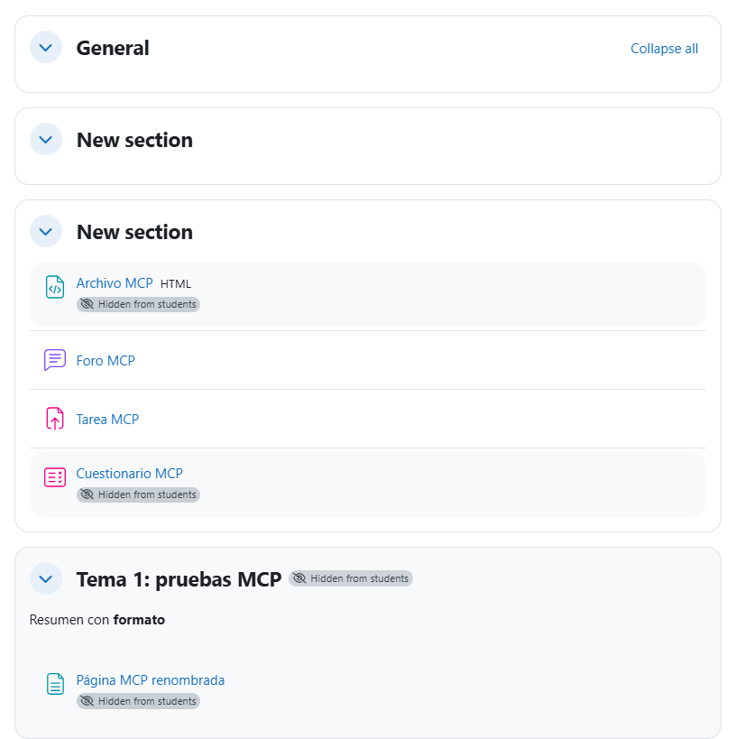
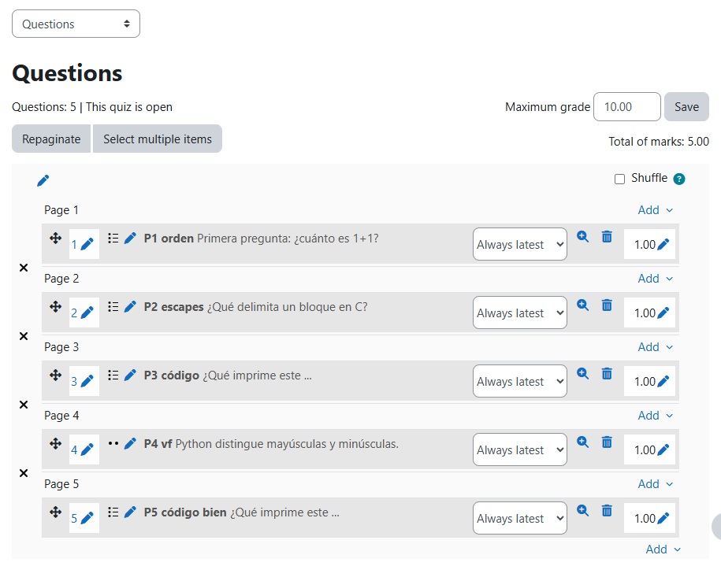
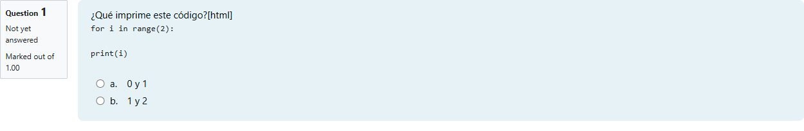
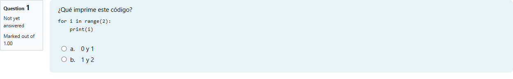
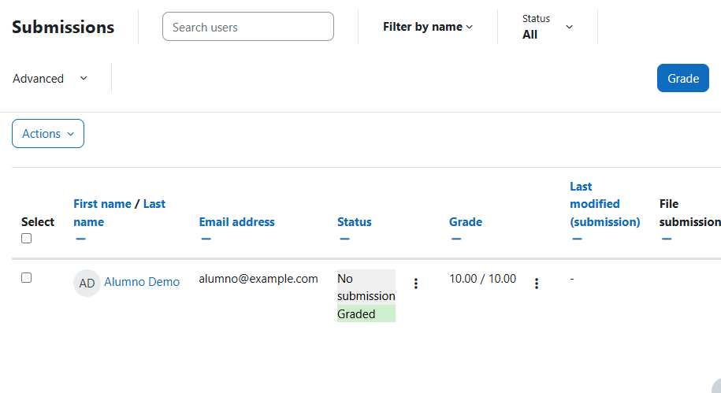
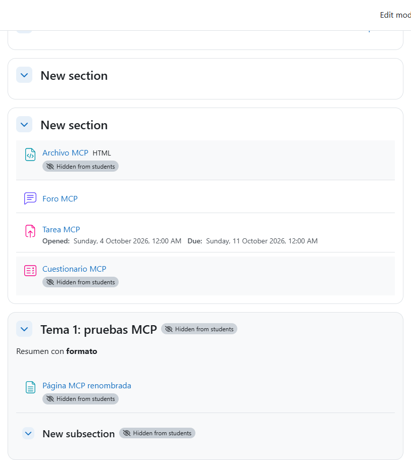

# Moodle sin clics: las operaciones del moodle-mcp en 4.5 y 5.2, con Boost y Classic

Prueba técnica de la vía que propone [ADR-019](../../.minispec/decisions/ADR-019-moodle-mcp.md): después de iniciar sesión, hacer todo lo que miyagi hace en Moodle sin pulsar nada en la interfaz, solo con peticiones HTTP de la sesión del profesor: los servicios AJAX de `lib/ajax/service.php` y los formularios por URL (GET, conservar los campos ocultos, cambiar solo lo necesario, POST y leer el resultado). No se ejecutó el agente: un script ([`probe.mjs`](probe.mjs), en esta carpeta) hizo cada operación en un curso vacío y comprobó el resultado leyéndolo de Moodle. Se repitió en las cuatro combinaciones que importan para los campus del Gobierno de Canarias (4.5 con Boost en EVAGD, 4.5 con Classic en Aulatic y eForma) y para la sandbox (5.2 con Boost).

| | |
| --- | --- |
| Fecha | 4 oct 2026, 01:06-02:28 UTC (03:06-04:28 hora peninsular) |
| Entorno | moodle-sandbox · Moodle 5.2.3+ (Build 20260916) en `localhost:8081`; una copia en modo 4.5 · Moodle 4.5.15 (Build 20261005) en `localhost:8082`; Docker; Chrome con playwright-core, sin ventana |
| Cursos | 5.2: `mcp-probe2` (id 8, Boost) y `mcp-classic` (id 11, Classic), más `mcp-probe3` y `mcp-probe4` (9 y 10) para repetir foro y GIFT; 4.5: `mcp-probe` (id 3, Boost) y `mcp-classic` (id 4, Classic). Todos creados vacíos con `npm run course` |
| miyagi | `afcab23` (sin cambios de código: la prueba es del diseño, no del agente) |
| Cuenta | `profesor` de cada sandbox (login por el formulario de Moodle) |
| Tema | Cambiado a Classic con `admin/cli/cfg.php --name=theme --set=classic` y devuelto a Boost al terminar, en las dos sandbox |

## Veredicto

**Superada con hallazgos.** Las 21 operaciones pasan en las cuatro combinaciones (4.5 y 5.2, Boost y Classic) sin un solo clic después del login, y lo creado coincide con lo que hay en la base de datos. El tema no cambia nada: los mismos formularios, campos y servicios en todas. Las diferencias entre versiones son las previstas (el banco de preguntas) y una herramienta las resuelve con una rama. Hay cuatro hallazgos que el diseño debe recoger: `new_module` solo crea subsecciones, `lib/upgrade.txt` no sirve para saber la versión, el GIFT pierde la sangría si `[html]` no va al principio, y añadir preguntas una a una deja cada una en su propia página.

## Qué se ejecutó

| Pasada | Combinación | Operaciones | Resultado |
| --- | --- | --- | --- |
| 1 | 5.2 Boost, curso 7 | 21 | Fallos del script (ids de `get_state` como texto, `modname` traducido); se corrigió el script, no Moodle |
| 2 | 5.2 Boost, curso 8 | 21 | 18 de 21: foro e importación GIFT, por el script (id del foro, nombre del formulario de importación en 5.x) |
| 3-4 | 5.2 Boost, cursos 9 y 10 | foro, GIFT, orden del cuestionario | Todas pasan |
| 5 | 5.2 Classic, curso 11 | 21 | 21 de 21 |
| 6 | 4.5 Boost, curso 3 | 21 | 21 de 21 |
| 7 | 4.5 Classic, curso 4 | 21 | 21 de 21 |

## Esperado frente a lo que pasó

| Operación | Vía | 4.5 Boost | 4.5 Classic | 5.2 Boost | 5.2 Classic |
| --- | --- | --- | --- | --- | --- |
| Leer la estructura (secciones y actividades) | AJAX `core_courseformat_get_state` | Sí | Sí | Sí | Sí |
| Añadir sección | AJAX `update_course` `section_add` | Sí | Sí | Sí | Sí |
| Renombrar sección y actividad | AJAX `core_update_inplace_editable` (`format_topics`/`sectionname`, `core_course`/`activityname`) | Sí | Sí | Sí | Sí |
| Resumen de sección con HTML | `course/editsection.php` GET→POST | Sí | Sí | Sí | Sí |
| Página oculta con un bloque de código | `course/modedit.php?add=page` GET→POST | Sí, sangría intacta | Sí | Sí | Sí |
| Error de validación detectado | POST con el nombre vacío | Sí: 200, sin redirección, «Required» | Sí | Sí | Sí |
| Crear con `new_module` y completar con `modedit` | AJAX `core_courseformat_new_module` | Solo `subsection` | Solo `subsection` | Solo `subsection` | Solo `subsection` |
| Mostrar, ocultar, ocultar sección | AJAX `cm_show`, `cm_hide`, `section_hide` | Sí | Sí | Sí | Sí |
| Mover sección y actividad | AJAX `section_move_after`, `cm_move` | Sí | Sí | Sí | Sí |
| Subir un HTML como recurso Archivo | `repository_ajax.php?action=upload` al borrador + `modedit.php?add=resource` | Sí | Sí | Sí | Sí |
| Foro: crear, abrir debate, responder | `modedit.php?add=forum`, `mod/forum/post.php`, AJAX `mod_forum_add_discussion_post` | Sí | Sí | Sí | Sí |
| Nota y comentario con HTML | AJAX `core_get_fragment` (`gradingpanel`) + `mod_assign_submit_grading_form` | Sí: 8,00 y el comentario intacto | Sí | Sí | Sí |
| Rúbrica: activarla y definirla (2 criterios) | `modedit.php?update` + `grade/grading/form/rubric/edit.php` POST con `rubric[criteria][NEWIDn]` | Sí, «lista para usar» | Sí | Sí | Sí |
| Calificar con la rúbrica | el mismo AJAX, con `advancedgrading[criteria][id][levelid]` | Sí: 10,00/10,00 | Sí | Sí | Sí |
| Importar GIFT (5 preguntas) | `question/bank/importquestions/import.php` con `courseid` (4.5) o con el `cmid` del banco `qbank` (5.2, creado con `question/banks.php?createdefault=1&sesskey=`) | Sí | Sí | Sí | Sí |
| Montar el cuestionario en orden | `mod/quiz/edit.php` POST `add=1` + `q<id>=1`, una a una | Sí, P1-P5 en orden | Sí | Sí | Sí |
| Modo edición | `editmode.php` POST `setmode` | Sí | Sí | Sí | Sí |
| Borrar lo creado y oculto | AJAX `cm_delete` | Sí | Sí | Sí | Sí |

Comprobado en las bases de datos de las dos sandbox: la tarea de cada curso tiene nota final 10,00 con comentario (cursos 3, 4, 8 y 11), cada foro tiene 2 mensajes (el debate y la respuesta; cursos 3, 4, 9 y 11) y en los cursos de la 4.5 quedan 4 actividades ocultas.

*El curso 4 de la 4.5, creado con Classic (capturado después de volver a Boost): la sección renombrada «Tema 1: pruebas MCP» con su resumen, la página renombrada, el archivo y el cuestionario ocultos. Foro y tarea se crearon visibles a propósito para poder calificar y responder.*

*Las cinco preguntas en el orden del GIFT, cada una en su página: añadirlas una a una con `addonpage=0` abre una página nueva por pregunta.*

*P3, con `[html]` a mitad del enunciado: el alumno ve «[html]» y la línea `print(i)` sin sangría.*

*P5, con `[html]` al principio y la sangría como `&nbsp;`: el código se ve como se escribió.*

*La tabla de entregas: «Graded», 10,00/10,00 con los niveles más altos de la rúbrica. El alumno es el ficticio de la sandbox.*

*El curso 8 de la 5.2: el mismo resultado; la subsección viene de la prueba de `new_module`.*

## Aprobaciones

No aplica: no se ejecutó el agente ni la puerta de publicación. El script publicó directamente en cursos de prueba de las sandbox.

## Hallazgos

1. **`core_courseformat_new_module` solo admite módulos con creación rápida.** En 4.5.15 y 5.2 devuelve «Module label/page/qbank does not support quick creation»; solo `subsection` funciona. Crear actividades va por `modedit.php?add=`, que funciona en todas. Estado: recogido en la ficha `moodle-mcp`.
2. **`lib/upgrade.txt` no dice la versión.** En la 5.2 empieza también por «=== 4.5 Onwards ===», y `UPGRADING.md` da la última versión con notas (4.5.14 en una 4.5.15) y no se sirve en la 5.2 (está fuera de `public/`). Señales que sí sirven sin ser administrador: el enlace a la documentación de Moodle de la página (`docs.moodle.org/502/`), que exista `question/banks.php` (5.0 en adelante) y que exista `course/format/update.php` (5.0 en adelante; da 404 sin parámetros en la 5.2, así que hay que probarla con ellos). `core_webservice_get_site_info` no está disponible por AJAX. Estado: abierto, para `capabilities()` en la ficha.
3. **GIFT: `[html]` va al principio y la sangría como `&nbsp;`.** Con `[html]` a mitad del enunciado, Moodle lo enseña como texto y quita los espacios al principio de cada línea. Es el «código sin sangría» de informes anteriores. Estado: regla del exportador en la ficha `moodle-mcp` y en `neutral-materials`.
4. **Añadir preguntas una a una deja una por página.** `set_quiz_questions` tendrá que fijar la paginación (`addonpage` o repaginar al final). Estado: abierto, en la ficha.
5. **En la 5.x el formulario de importación es `_qf__qbank_importquestions_form_question_import_form`** y en las dos versiones tiene el campo `newfile`: buscar los formularios por sus campos y no por el nombre de la clase. Estado: regla de `client.ts` en la ficha.
6. **La sandbox no instala la 4.5 tal como está:** el proyecto Docker tiene nombre fijo y la raíz web es `public/` (solo existe desde 5.1); en Windows el clon necesita `core.longpaths`. Se probó con una copia con esos tres cambios. Estado: abierto, para moodle-sandbox (está en la ficha).

## Qué se añadió y dónde

- [ADR-019](../../.minispec/decisions/ADR-019-moodle-mcp.md) y la ficha [`moodle-mcp`](../../.minispec/features/moodle-mcp.md) recogen la vía y los hallazgos. Nada cambió todavía en `plugin/` ni en `prompts/`: el agente sigue usando el navegador hasta que exista el MCP.

## Qué no cubrió

- Ningún campus real: ni el login por CAS ni el comportamiento con un tema hijo de Boost o Classic del centro.
- Atto como editor del profesor en la 4.5 (los POST no pasan por el editor, así que no debería importar, pero no se probó).
- Formatos de curso distintos de temas (`weeks`, de terceros), grupos y restricciones de acceso (`availabilityconditionsjson`), libros, SCORM, H5P, el calificador del curso y los cuestionarios con preguntas aleatorias.
- Varias peticiones a la vez o un curso grande; los tiempos no son representativos (las dos sandbox compartían Docker).
