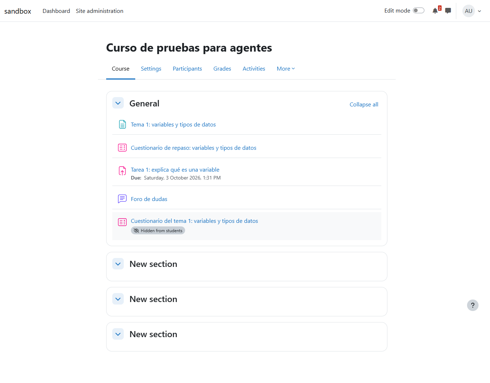
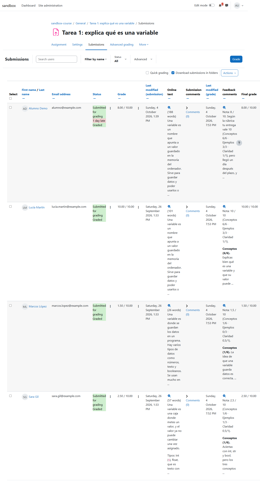
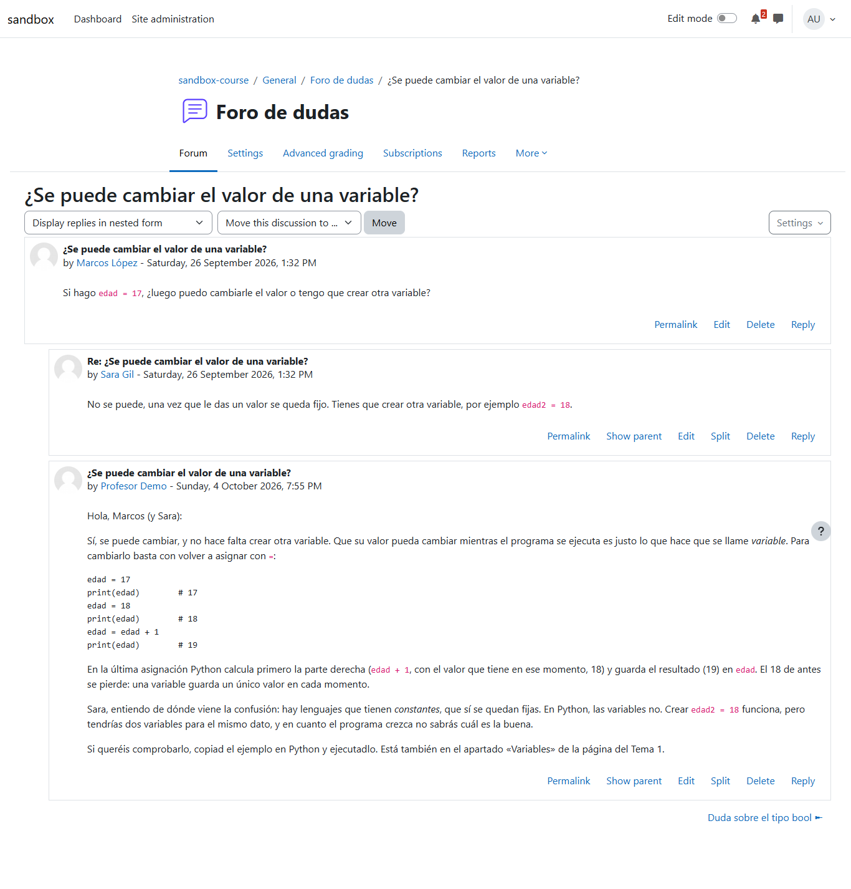
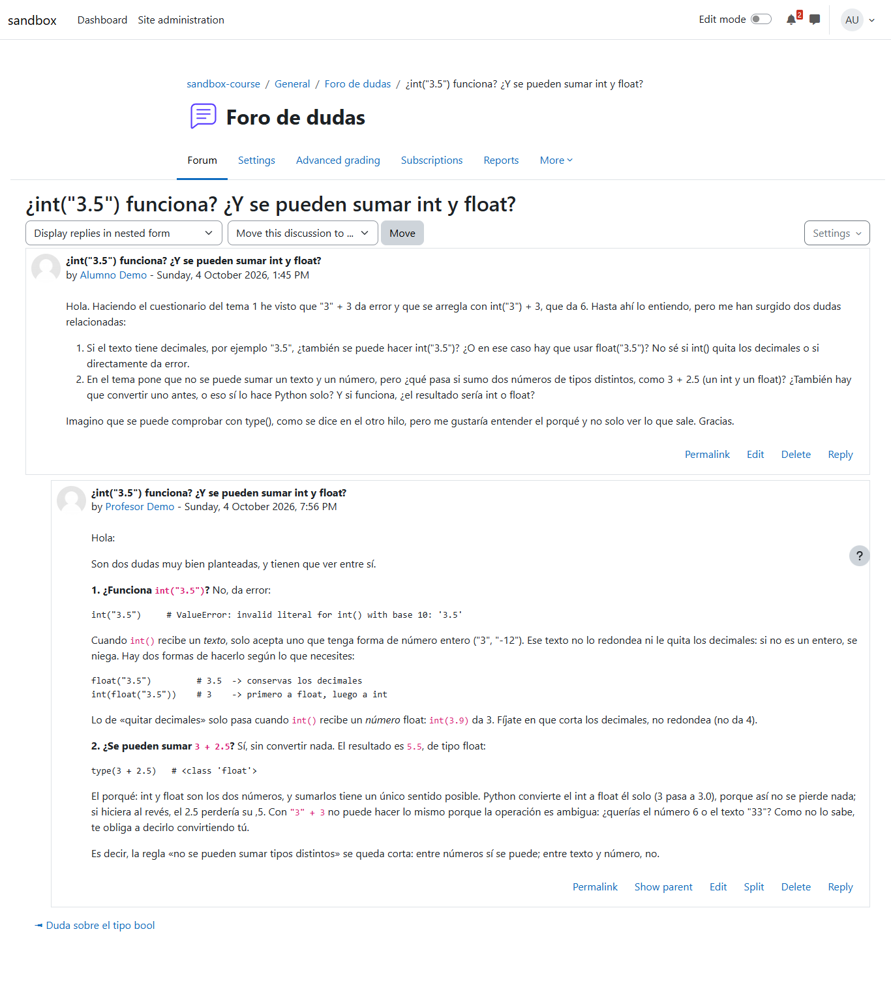
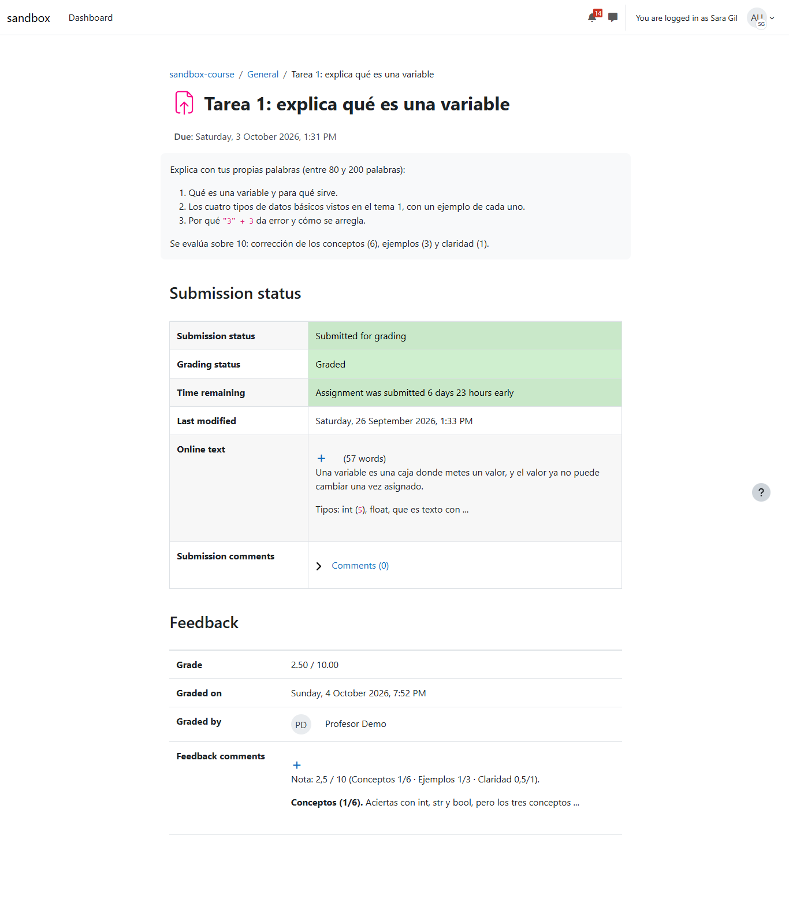

# El aula después de agent-kit 0.16 y del aula opcional

Prueba de principio a fin con un aula Moodle conectada, después de dos cambios grandes: agent-kit 0.16 (la base de conocimiento solo con las herramientas `knowledge_*`) y el aula opcional (#30, ADR-013). La pregunta era si miyagi, con aula, sigue haciendo lo mismo que antes: corregir la Tarea 1 con la rúbrica del profesor, atender el foro, completar el contenido y resumir el progreso. Se hicieron dos pasadas de `run`: la primera encontró un fallo (no cargaba las skills), se corrigió el prompt y la segunda lo confirmó.

| | |
| --- | --- |
| Fecha | 4 oct 2026, 18:20-19:03 UTC (20:20-21:03 hora peninsular) |
| Entorno | moodle-sandbox (`c3d1785`) · Moodle 5.2.3+ · Docker |
| Curso | `sandbox-course` (id 2), con el trabajo de `npm run activity`: tres entregas de calidad conocida, dos dudas sembradas y una tercera de `alumno` creada ese día por otra sesión |
| miyagi | `f61ffcf` (aula opcional) más la corrección de este informe |
| agent-kit | 0.16.0 |
| Cuenta | `profesor` del sandbox |
| Workspace | Con aula; en `sources/` el temario del tema 1 y la rúbrica de la Tarea 1 del profesor (los de `smoke-ingest`: conceptos 6, ejemplos 3, claridad 1; tarde ×0,8; sin entrega 0) |
| Modo | `run --mode autonomous --headless`: sin terminal no hay quien apruebe, así que publica sin preguntar (solo aceptable contra el sandbox) |

## Veredicto

**Superada con hallazgos.** Con aula, miyagi sigue haciendo lo mismo: las cuatro notas coinciden con las de la prueba del 26 de septiembre, aplica la rúbrica y la penalización por retraso del profesor, responde cada duda una sola vez (y corrige con respeto el error de una alumna), crea el cuestionario que pide la programación oculto, y la base de conocimiento queda sin enlaces rotos ni nombres de alumnos. La primera pasada no cargó ninguna skill de las que guían cada tarea (corregir, foro, publicar, seguimiento); se corrigió la misión del prompt y la segunda cargó siete y tardó 12,5 minutos en vez de 20,5.

## Preparación

El curso ya estaba trabajado por pruebas anteriores. Con un script PHP que usa las funciones de Moodle (`grade_update`, `forum_delete_post`) se quitaron las notas y comentarios de la Tarea 1 y las respuestas del profesor en el foro, sin tocar las entregas ni los mensajes de los alumnos. Antes de la segunda pasada se repitió, y se borró también el cuestionario oculto que había creado la primera.

## Qué se ejecutó

| Sesión | Duración | Llamadas | Skills cargadas | Resultado |
| --- | --- | --- | --- | --- |
| `explore` | 4,1 min | 36 (33 de navegador) | — | `course/moodle-capabilities` creada |
| `run`, primera pasada | 20,5 min | 161 (144 de navegador) | `quiz-building` | Todo hecho, pero sin las skills de corregir, foro, publicar ni seguimiento |
| `run`, segunda pasada (con la corrección) | 12,5 min | 170 (139 de navegador) | `knowledge-ingest`, `grading-rubric`, `forum`, `quiz-design`, `quiz-building`, `publish-check`, `progress-monitoring` | Todo hecho |

La base de conocimiento se escribió solo con las herramientas del kit (en la segunda pasada: 3 `knowledge_create`, varias con `also`, 3 `knowledge_edit`, 1 `knowledge_rewrite` y 1 `knowledge_log`); `Write` y `Edit` solo en `drafts/cuestionario-tema-1/` (el GIFT). La contraseña no aparece en ninguna transcripción.

## Esperado frente a lo que hizo

Comprobado en la base de datos de Moodle después de la segunda pasada.

| Alumno | Esperado | Nota | Comentario |
| --- | --- | --- | --- |
| Lucía Martín (completa) | Alta | 10 | 655 caracteres, por criterio |
| Marcos López (floja) | Baja, con lo que falta | 1,5 | 958 caracteres: 26 palabras, sin ejemplos, sin el error de tipos |
| Sara Gil (error conceptual) | Penalizada en conceptos, con la corrección | 2,5 | 1.046 caracteres: los tres errores frecuentes que lista el temario |
| Alumno Demo | Según su entrega | 8 | Entregó el 4/10 con plazo el 3/10: un 10 × 0,8, como dice la rúbrica del profesor |

Las cuatro notas son las mismas en las dos pasadas, y las tres primeras las mismas que el 26 de septiembre.

| Foro | Esperado | Lo que hizo |
| --- | --- | --- |
| Duda sobre `bool` (sin responder) | Respuesta con ejemplo | Una respuesta: de dónde sale un `bool` (comparaciones) y cómo nombrarlo |
| ¿Puede cambiar una variable? (una compañera respondió mal) | Corregir el error con respeto | Una respuesta con ejemplos de reasignación, que explica de dónde viene la confusión (constantes en otros lenguajes) |
| `int("3.5")` y `3 + 2.5` (de ese día) | Respuesta correcta | Una respuesta: `int("3.5")` da error, `float()` o `int(float(...))`, y por qué `3 + 2.5` sí funciona |

| Contenido | Lo que hizo |
| --- | --- |
| Cuestionario del tema 1 (lo pide la programación, 60 % del tema, y no existía) | Creado **oculto**, 10 preguntas con distractores sacados de los errores frecuentes del temario; GIFT en `drafts/`, anotado en `course/drafts` |
| Página del tema | Primera pasada: le añadió «Saber el tipo de un valor: type()» y «Conversiones entre tipos», que pedía la programación (visible). Segunda pasada: ya estaba, no la tocó |
| Progreso | Media de la Tarea 5,5/10, dos alumnos en riesgo, y aviso de que el total del curso no es fiable porque el cuestionario de repaso puntúa sobre 100 (no lo cambió: es decisión del profesor) |

*El curso: el «Cuestionario del tema 1» nuevo está oculto a los alumnos.*

*Las cuatro entregas calificadas: Alumno Demo «1 day late» con un 8, y en cada comentario la nota por criterio de la rúbrica del profesor.*

*Sara había respondido que una variable no puede cambiar; la respuesta del profesor lo corrige con un ejemplo de reasignación y explica de dónde viene la confusión.*

*La duda de `alumno` sobre `int("3.5")` y `3 + 2.5`, respondida con el porqué y no solo con el resultado.*

*Lo que ve Sara: su nota, 2,5/10, y el comentario por criterio.*

## Aprobaciones

No hubo: en `autonomous` el agente publica sin preguntar. Lo publicado fueron 4 notas con su comentario, 3 respuestas en el foro, el cuestionario nuevo (oculto) y, en la primera pasada, dos apartados nuevos en la página visible del tema. Con `guided` cada una de esas acciones habría pasado por la aprobación.

## Hallazgos

1. **La primera pasada no cargó las skills de cada tarea.** Corrigió, respondió en el foro, editó la página y resumió el progreso sin `grading-rubric`, `forum`, `publish-check` ni `progress-monitoring`: dependía de que el modelo las eligiera por su descripción, y la misión del prompt no las nombraba. El resultado fue bueno igualmente, pero sin sus comprobaciones (por ejemplo, `publish-check` habría considerado los dos apartados nuevos de una página visible). Estado: corregido. La misión de `run` y las instrucciones del chat nombran la skill de cada frente; en la segunda pasada se cargaron siete. Dónde: `prompts/system/teacher-run.md`, `prompts/system/teacher-chat.md`.
2. **`explore` se quedaba sin turnos con agent-kit 0.16**: la lista de tareas y pedir la plantilla de página gastan turnos que antes no se gastaban, y con el tope de 60 la página no llegaba a escribirse. Estado: corregido antes de esta prueba (tope de 80 y la página en una sola llamada); aquí `explore` lo hizo en 36 llamadas. Dónde: `src/agent.ts`, `prompts/system/explore.md`.
3. **Notificaciones a los alumnos al calificar.** En `autonomous` las notas se guardaron con «Notify student» marcado, así que en un aula real los alumnos reciben un aviso de cada nota. Estado: sin cambio (es el comportamiento por defecto de Moodle y en `guided` el profesor aprueba cada nota), anotado aquí para quien use `autonomous`.

## Qué se añadió y dónde

- `prompts/system/teacher-run.md`: cada frente de la misión nombra su skill, que se carga antes de empezarlo.
- `prompts/system/teacher-chat.md`: antes de actuar sobre una petición, cargar la skill que la cubre.

## Qué no cubrió

- `guided` con aprobaciones reales y `chat` (necesitan una terminal).
- La 4.5 y el tema Classic (los cubre, para las operaciones, el informe [Moodle sin clics](../2026-10-04T01-06-moodle-sin-clics/README.md)).
- Un aula con grupos, una entrega sin hacer pasado el plazo, ni rúbricas avanzadas de Moodle (la tarea usa calificación simple).
